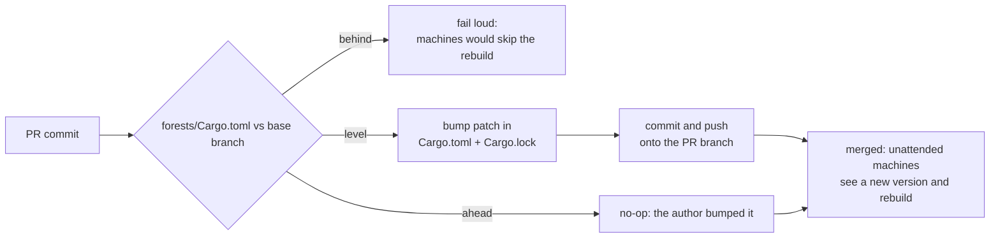

# NEAT-AI-Forests


An experimental Rust optimiser for already-fit
[NEAT-AI](https://github.com/stSoftwareAU/NEAT-AI) creatures. It reads a mature
creature and its training corpus, measures the errors the creature still makes,
searches for tree-shaped corrections to them, grafts the promising ones onto
**copies** of the creature as ordinary NEAT-AI `IF` structure, and lets the
[NEAT-AI-scorer](https://github.com/stSoftwareAU/NEAT-AI-scorer) decide which — if
any — is genuinely fitter.

> **Find all the dirty tricks that uncover real improvements — but trust only the scorer.**

Candidate generation may be adventurous. **Acceptance is deliberately boring.**

## What it does

```text
fittest creature ─▶ residuals ─▶ split search ─▶ patches ─▶ grafted clones ─▶ scorer ─▶ best.json
```

- **Reads, never writes, the creature you give it.** Every candidate is a clone.
- **Only adds structure.** A patch becomes an `IF` subtree feeding the output it
  corrects; nothing evolved is deleted, simplified or rewired.
- **Never accepts its own opinion.** Histogram gain, sampled scores and every
  other proxy rank candidates; only a full-corpus NEAT-AI-scorer result accepts
  one.
- **Writes down what it tried.** Every candidate, proxy, score and verdict lands
  in `experiments.jsonl`, and `neat_ai_forests report` turns that into the
  economics of each strategy.
- **Shares what it learns.** With `--learnings-dir`, a fleet replays each
  other's verified wins and stops paying twice for the same failure.

It is a genuine experiment, and the question it asks is narrow:

> **Can a fundamentally different search process discover small improvements that
> normal evolution is now finding only slowly?**

So far, yes — see [docs/benchmarks.md](docs/benchmarks.md) for what has been
measured, including the strategies that turned out not to be worth their
runtime.

NEAT-AI-Forests is **not** an attempt to replace that creature, retrain it from
scratch, or redesign the working system. The motivating creature has been
evolved for years to predict **90-day stock movement** and is useful in
production.

---

## Status

Every phase in the [issue list](https://github.com/stSoftwareAU/NEAT-AI-Forests/issues)
has landed as code: immutable incumbent and scorer-parity gate, quantile-bin and
residual caches, CPU stump search,
portable patches grafted as ordinary `IF` structure, two-phase screening with
authoritative promotion, the 45-minute evolution loop and journal, depth-2/3
trees, sampling and random "dirty tricks", oblique splits, the XGBoost external
control, and the shared learnings cache. The phase table and the outstanding
work are at the bottom of this file.

One shared-family prerequisite is still open upstream:

- [NEAT-AI-scorer #574](https://github.com/stSoftwareAU/NEAT-AI-scorer/issues/574) — CPU/GPU parity for `IF`-heavy creatures. Until it lands, production runs should pass `--scorer-arg=--gpu=off` or watch the `baselineDrift` field in the journal.

---

## Quick start

Forests is a Rust workspace that depends on the sibling
[NEAT-AI-core](https://github.com/stSoftwareAU/NEAT-AI-core) checkout and
invokes the [NEAT-AI-scorer](https://github.com/stSoftwareAU/NEAT-AI-scorer)
binary (`rust_scorer`) as the judge:

```text
parent/
├── NEAT-AI-core/      # path dependency: ../../NEAT-AI-core/neat-core
├── NEAT-AI-scorer/    # build it: cargo build --release  →  target/release/rust_scorer
└── NEAT-AI-Forests/
```

```bash
cargo build --release                       # CPU build

./target/release/neat_ai_forests creature.json training/ \
  --scorer ../NEAT-AI-scorer/target/release/rust_scorer \
  --output-dir runs/first --timeout-seconds 2700

./target/release/neat_ai_forests report runs/first/experiments.jsonl
```

The source `creature.json` is never written to. `best.json` starts as a
byte-for-byte copy and is only replaced by a creature the scorer verified on
the full corpus in the same call as its parent.

### Command line

```text
neat_ai_forests <creature.json> <training-data-dir> [OPTIONS]
neat_ai_forests report <experiments.jsonl>
neat_ai_forests <creature.json> <training-data-dir> export-matrix  [--out CSV] [--max-records N] [--output J]
neat_ai_forests <creature.json> <training-data-dir> import-xgboost --dump dump.json [--output J] [--allow-missing-divergence]
neat_ai_forests prune-learnings --dir <learnings-dir> [--corpus ID] [--host H] [--dry-run]
```

`prune-learnings` keeps the shared cache (#61) from growing without bound, and
is safe to run from cron on an idle host. It only ever touches the file this
host writes, so it needs no coordination with the rest of the fleet, and
dropping an old rejection is the point rather than a side effect: it puts that
experiment back on the table.

| Flag | Default | Meaning |
|---|---|---|
| `--dir` | — | the shared learnings cache root, as passed to `--learnings-dir` |
| `--corpus` | every corpus found | which corpus directory to prune |
| `--host` | hostname | whose file to prune; only ever this one |
| `--rejected-after-hours` | `720` | drop rejections older than this — must exceed `--learnings-retry-after-hours`, or a rejection is dropped before it is ever retried |
| `--accepted-after-hours` | `4320` | drop acceptances older than this; far longer, since wins are what the cache is for |
| `--max-records` | `0` | cap on the records a host keeps, newest first (0 = uncapped) |
| `--dry-run` | off | report what would go without writing anything |

| Flag | Default | Meaning |
|---|---|---|
| `--output-dir` | `.` | `best.json`, `experiments.jsonl`, `winners/`, `workspace/` |
| `--cache-dir` | training dir | where `forests-bins.cache` / `forests-residuals-*.cache` live |
| `--scorer` | `rust_scorer` | NEAT-AI-scorer binary |
| `--scorer-arg` | — | extra scorer argument, repeatable (e.g. `--scorer-arg=--gpu=off`) |
| `--timeout-seconds` | `2700` | 45-minute wall-clock budget |
| `--max-iterations` | — | stop after N iterations |
| `--seed` | drawn | RNG seed; printed for replay |
| `--min-improvement` | `1e-6` | strict authoritative Δscore required to accept |
| `--bins` | `256` | quantile bins per observation |
| `--bin-sample-records` | `65536` | records sampled per feature for quantiles |
| `--bin-memory-budget-mib` | `256` | memory per bin-cache pass |
| `--chunk-records` | `4096` | records per streaming chunk |
| `--analysis-threads` | `4` | threads for residual extraction and CPU histogram accumulation |
| `--search-records` | `200000` | in-memory search sample (0 = whole corpus) |
| `--row-sampling` | `stride` | `stride`, `uniform`, `stratified`, `residual-weighted` |
| `--feature-selection` | `all` | `all`, `random`, `error-ranked` |
| `--feature-fraction` | `0.25` | fraction kept under random / error-ranked |
| `--min-leaf-records` | `50` | minimum records in a corrected leaf |
| `--max-correction` | `1` | clamp on leaf corrections (pre-squash units) |
| `--min-gain` | `0` | minimum proxy gain reported |
| `--stump-kinds` | all three | `left-only`, `right-only`, `two-leaf` |
| `--top-k` | `16` | stumps kept per search |
| `--max-per-feature` | `2` | diversity cap per feature (0 = off) |
| `--max-depth` | `3` | tree depth 1–3 |
| `--growth` | `best-first` | `level-wise` or `best-first` |
| `--tree-roots` | `8` | distinct stump features grown into trees each iteration, on top of the unconstrained best-first tree; trees are the most valuable candidates per scorer call |
| `--magnitude-scales` | `1.0,0.5,0.25` | leaf scales around the analytical optimum |
| `--threshold-jitter` | `0` | neighbouring bins tried per top stump |
| `--random-candidates` | `4` | deliberately random stumps per iteration |
| `--oblique-candidates` | `0` | oblique 2–3 feature splits per iteration |
| `--boost-rounds` | `1` | boosting rounds on the sample: subtract the best patch, search again; bundle prefixes verified in one scorer call |
| `--combo-candidates` | `4` | combinations: top-2…top-N distinct discoveries stacked on one clone, plus last iteration's near-winners carried forward |
| `--candidates` | `64` | maximum grafted candidates per iteration |
| `--graft-constants` | `shared` | who owns a graft's three bias-1 constants: `shared` (one set per creature) or `per-patch` (`forest-<patch id>-one-c/p/n`, three extra constant neurons per patch, blast radius of one patch) |
| `--screen-sample-rate` | `0.05` | scorer sample rate for the screen; 0 disables; skipped automatically when the cohort already fits `--promote-count` |
| `--screen-threshold` | `0` | sampled Δ required to promote |
| `--promote-count` | `8` | candidates promoted to full scoring |
| `--explore-quota` | `1` | screen rejects fully scored to measure false negatives |
| `--baseline-drift-epsilon` | `1e-6` | tolerated same-call vs stored baseline disagreement |
| `--skip-parity` | off | skip the local-MSE vs scorer parity gate (non-MSE costs) |
| `--parity-abs` / `--parity-rel` | `1e-7` / `1e-4` | parity tolerances |
| `--preserve-candidates` | off | keep per-iteration cohort directories |
| `--max-consecutive-scorer-failures` | `3` | abort after this many failures in a row |
| `--learnings-dir` | off | shared cache of full-corpus verdicts (#60); point every host at one git checkout and the fleet replays each other's wins |
| `--learnings-host` | hostname | the file this machine appends to, so no two hosts ever conflict |
| `--learnings-replay` | `8` | cached candidates replayed per iteration (0 = write only) |
| `--learnings-retry-after-hours` | `168` | how long a candidate that only ever failed is left alone before it is offered again |

`--help` and `--version` are the usual clap extras. The scorer's own
`--sample-rate`, `--sample-phase`, `--gpu` and `--cost` flags are passed by
Forests, not by you.

---

## How a run works

1. **Incumbent** — load through NEAT-AI-core, refuse anything that does not compile or round-trip, checksum it (SHA-256), copy it byte-for-byte into `workspace/incumbent.json` with `incumbent.meta.json`.
2. **Bin cache** — stream the corpus once per feature block and persist ~256 equal-population quantile edges per observation (`forests-bins.cache`, reused only for the identical corpus/version/bin count).
3. **Residuals** — run the incumbent over every record; store `target − prediction` and the pre-squash *correction-space* residual in a sidecar keyed by incumbent checksum × corpus identity.
4. **Baseline** — score the incumbent alone with the full-corpus scorer; compare its `error` with the local MSE (parity gate, fail closed); journal the result.
5. **Search** — build the quantised search set (sampled rows/features as configured), accumulate per-feature histograms, rank stumps; optionally grow depth-2/3 trees and oblique splits.
6. **Candidates** — expand discoveries into patches (analytical optimum, one-sided variants, magnitude scales, threshold jitter, random controls), graft each onto a clone, discard anything NEAT-AI-core rejects — including anything `neat_core::creature_validate` rules invalid, with the reason journalled (see [docs/architecture.md](docs/architecture.md#creature-validation)).
7. **Screen** — the scorer's record-sampling mode ranks the cohort; the top `--promote-count` plus an exploratory bypass quota go on.
8. **Promote** — full-corpus scorer call with the baseline in the same cohort; accept only `Δscore > --min-improvement` and only if the same-call baseline matches the stored one.
9. **Repeat** — a winner becomes the experimental incumbent, `best.json` and `winners/winner-NNNN.json` are written, residuals are recomputed, and the loop continues until the budget ends.

---

## Outputs

| Path | Content |
|---|---|
| `best.json` | best scorer-verified creature (pretty JSON, original tags preserved, `score`/`error`/`forests` tags upserted) |
| `experiments.jsonl` | append-only journal, one JSON object per line with a `record` discriminator |
| `winners/winner-NNNN.json` | every accepted intermediate |
| `workspace/incumbent.json`, `incumbent.meta.json`, `baseline.json` | immutable copy, checksum metadata, authoritative baseline record |
| `<cache-dir>/forests-bins.cache` | quantile-bin cache (see [docs/caches.md](docs/caches.md)) |
| `<cache-dir>/forests-residuals-<checksum>.cache` | residual sidecar per incumbent |

### Journal records

- `runHeader` — timestamp, seed + source, version, incumbent checksum, corpus identity, bin-cache identity, the complete effective configuration.
- `baseline` — authoritative score/error, scorer identity, cost name, parity verdict (written at start and after every acceptance).
- `experiment` — per iteration: search backend/set/records/features/strategies, timings, every candidate's patch + provenance, its **screen** score and its **full** score recorded separately, promotion/bypass flags, winner, improvement, acceptance, new incumbent checksum, screen false-positive/false-negative counts, scorer error or baseline veto, and `discarded` — every rejected candidate with the verbatim graft/validation reason.
- `summary` — stop reason, iterations, acceptances, opening/final score, wall time.

`neat_ai_forests report` folds the journal into the economics metrics: cumulative improvement, **improvement per wall-clock hour**, time to first acceptance, candidates per minute, search vs scorer time, screen false-positive/negative rates, and per-strategy / per-backend / per-depth winner counts and accepted gain. `scripts/report-experiments.sh` compares several journals side by side.

---

## Safety invariants

This experiment exists to continue evolution without risking a creature that already works.

1. **The supplied incumbent is immutable.** Forests never modifies the source creature in place.
2. **Every candidate starts from a clone of a known incumbent.**
3. **Version 1 only adds small corrective structure.** It does not delete, simplify or rewire mature evolved structure.
4. **Cheap search is allowed to be wrong.** Histogram gain, residual reduction, sampled scoring and other proxies are ranking signals only.
5. **Full-corpus NEAT-AI-scorer is the final authority.** A candidate is not an improvement until the scorer says it is.
6. **Scorer failure means no winner.** Missing, malformed or inconsistent results fail closed.
7. **`best.json` may never be worse than the opening scorer-verified baseline.**
8. **After an accepted change, residuals are recomputed.** Forests never assumes predicted gains remain valid after the creature changes.
9. **Random accidents are legitimate discoveries.** We care about measurable improvement, not whether the winning idea looked clever beforehand.
10. **Negative results are results.** A dirty trick that consumes time but produces no verified improvements should be measured and discarded.

---

## Non-goals

Forests is **not**:

- a replacement for NEAT-AI;
- a replacement for the production creature;
- a new stock-prediction model trained independently from scratch;
- permission to rewrite or simplify years of evolved structure because another algorithm thinks it looks cleaner;
- an optimiser allowed to accept its own estimated gain;
- an online/live-trading decision engine;
- proof that decision trees are inherently better than neural/evolutionary methods;
- committed to keeping any strategy that fails to produce real improvements economically.

---

## Why residual trees


The search mechanism and the acceptance mechanism are intentionally independent.

Forests may use approximate arithmetic, samples, heuristics, statistics, random guesses or approximations to decide **what is worth trying**. None of those may decide **what is better**.

Only the authoritative scorer gets that vote.

### Residual evolution

The useful mental model is not "replace the neural network with a forest".

The mature creature already represents a valuable function:

```text
f(x)
```

Forests searches for a small conditional correction:

```text
g(x)
```

and tests the complete candidate:

```text
f'(x) = f(x) + g(x)
```

For example, a first-generation patch might effectively say:

```text
if observation_317 > 0.283:
    correction = +0.013
else:
    correction = 0
```

Most of observation-space can therefore retain the incumbent's existing behaviour exactly, while Forests asks whether a particular region contains a systematic residual error worth correcting.

This is much closer to **boosting a mature evolved model** than training a conventional random forest from scratch.

### Why decision trees?

Decision trees offer a type of search that ordinary gradient methods find awkward: **hard, discontinuous partitions**.

NEAT-AI already has the building block required to represent them: the `IF` aggregate and typed condition/positive/negative synapses.

A conventional split:

```text
RSI_14 > 63
```

can therefore become ordinary NEAT-AI creature structure rather than requiring a second model runtime.

Nested `IF` nodes can represent deeper trees, and NEAT-AI has an additional capability that conventional axis-aligned trees usually do not: an `IF` condition can eventually be an **oblique split** such as:

```text
0.8 * RSI_14 - 1.3 * PE + 0.4 * momentum > threshold
```

That is deliberately later research. The experiment starts with simple one-feature stumps because they are easy to verify and cheap to search.

### Why "Forests"?

The name is playful rather than a commitment to a conventional Random Forest algorithm.

Forests may explore many competing tree-shaped corrections at once, but the likely evolutionary pattern is closer to sequential boosting:

```text
mature creature
    ↓
find a residual pattern
    ↓
try many small tree patches
    ↓
scorer accepts one (or none)
    ↓
recompute residuals
    ↓
search again
```

The final creature remains a normal NEAT-AI creature.

### What we want to steal from XGBoost

[XGBoost](https://github.com/dmlc/xgboost) is an important source of ideas, not a planned runtime dependency.

The most interesting concepts for this experiment include:

- **quantile/binning of continuous observations** so every raw value is not tested as a threshold;
- **histogram split search** using compact sufficient statistics;
- **row subsampling**;
- **feature/column subsampling**;
- **error/gradient-biased sampling** so search effort concentrates on informative records;
- **minimum leaf support and complexity controls** to avoid chasing tiny pathological subsets;
- **sequential residual correction / boosting**;
- using a real XGBoost model as an **external scientific control** to see whether conventional boosted trees can find residual structure our native search misses.

We want to understand and adapt useful techniques to the NEAT-AI problem, not copy XGBoost's architecture wholesale.

Forests is Rust-first. A GPU histogram kernel was built and measured at 0.17x the CPU path on unified memory, and deleted (#67): search is under a fifth of wall clock, so the lever is reusing accumulations across tree levels (#69), not another backend.

### Search philosophy: dirty is fine, dishonest is not

Examples of fair experimental tactics include:

- exhaustive quantile stump search;
- random feature subsets;
- random/stratified record subsets;
- residual-magnitude-weighted sampling;
- threshold jitter around promising boundaries;
- several correction magnitudes around a statistical optimum;
- deliberately random stumps;
- diversity selection so one promising feature does not monopolise a batch;
- shallow depth-2/3 trees;
- eventually sparse multi-feature/oblique splits;
- importing a small XGBoost tree as a candidate control.

Every candidate must record what produced it. Random search must be called random search. Approximate search must be called approximate search.

The metric that matters is not elegance or proxy gain. It is:

> **scorer-verified improvement per wall-clock hour.**

---

## What success looks like

The experiment succeeds if it increases the **rate at which verified improvements are found** for a creature whose ordinary evolutionary progress has become difficult.

Useful measurements include:

- time to first accepted improvement;
- accepted improvements per 45-minute run;
- cumulative scorer improvement;
- candidates searched/scored per minute;
- improvement rate by strategy;
- depth-1 vs deeper-tree economics;
- how concentrated each gain is across the corpus;
- whether repeated residual grafting continues producing improvements or quickly saturates;
- comparison with Lamarck, Discovery, random search and the XGBoost control.

If the evidence says a clever technique is useless, remove it.

If dumb luck repeatedly wins, generate more dumb luck.

**The scorer does not care about our theory, and neither should the experiment.** 🌳🧬

---

## Repository layout

```text
NEAT-AI-Forests/
├── Cargo.toml                 # workspace
├── forests/
│   ├── Cargo.toml             # neat_ai_forests (lib + bin)
│   ├── src/
│   │   ├── main.rs            # CLI
│   │   ├── lib.rs
│   │   ├── baseline.rs        # authoritative baseline + parity gate (#2)
│   │   ├── bins.rs            # quantile-bin cache (#3)
│   │   ├── cancel.rs          # SIGINT/SIGTERM cooperative cancellation
│   │   ├── candidates.rs      # candidate population (#8)
│   │   ├── config.rs          # ForestsConfig + validation
│   │   ├── corpus.rs          # corpus identity + bounded-memory streaming
│   │   ├── graft.rs           # patch → IF structure on a clone (#7), validated (#39)
│   │   ├── histogram.rs       # CPU reference stump search (#5)
│   │   ├── incumbent.rs       # immutable incumbent + checksum (#2)
│   │   ├── journal.rs         # experiments.jsonl records (#10)
│   │   ├── learnings.rs       # fleet-shared cache of what worked / failed (#60)
│   │   ├── log.rs             # stderr logging
│   │   ├── meta.rs            # creature tag preservation
│   │   ├── oblique.rs         # multi-feature linear splits (#14)
│   │   ├── patch.rs           # portable patch format + evaluator (#7)
│   │   ├── promote.rs         # screen + authoritative promotion (#9)
│   │   ├── report.rs          # journal economics report (#15)
│   │   ├── residuals.rs       # residual extraction + sidecar (#4)
│   │   ├── run.rs             # the evolution loop (#10)
│   │   ├── scorer.rs          # rust_scorer integration
│   │   ├── strategies.rs      # sampling / feature selection (#12)
│   │   ├── tools.rs           # export-matrix / import-xgboost (#13)
│   │   ├── tree.rs            # depth-2/3 growth (#11)
│   │   └── xgboost.rs         # XGBoost dump conversion (#13)
│   ├── examples/stump_search_bench.rs
│   └── tests/                 # README contract, real-scorer integration
├── docs/                      # architecture, caches, patch format, strategies, xgboost control, benchmarks, learnings cache
│   └── archive/pr-summaries/  # one summary per merged PR
├── scripts/                   # quality helpers, auto-version.sh, report-experiments.sh, run-benchmark.sh, xgboost-control.py
├── quality.sh                 # local gate mirroring CI
└── .github/workflows/         # CI, security, gitleaks, markdown lint, actionlint, dependency review, SBOM, semgrep
```

---

## Documentation

- [docs/architecture.md](docs/architecture.md) — module map and data flow.
- [docs/caches.md](docs/caches.md) — bin-cache and residual-sidecar binary formats and invalidation rules.
- [docs/patch-format.md](docs/patch-format.md) — patch JSON, `IF` graft layout, exact routing semantics.
- [docs/learnings.md](docs/learnings.md) — the shared cache of what worked and what failed, and how a fleet uses it.
- [docs/strategies.md](docs/strategies.md) — sampling, jitter, diversity, random controls and how they report themselves.
- [docs/xgboost-control.md](docs/xgboost-control.md) — the external control experiment.
- [docs/benchmarks.md](docs/benchmarks.md) — measured economics and the production-run protocol.
- [docs/archive/pr-summaries/](docs/archive/pr-summaries/) — the PR summary for each merged change.

---

## Development

The toolchain is pinned in `rust-toolchain.toml` (the same channel as the
NEAT-AI Rust family). `./quality.sh` mirrors CI: shellcheck, codespell,
markdownlint, actionlint, cargo-deny, `cargo fmt --check`, clippy with
`-D warnings`, tests (`--all-features`) and rustdoc. See
[CONTRIBUTING.md](CONTRIBUTING.md).

### Versioning

The unattended machines rebuild the binary only when the crate version changes,
so every PR must leave `forests/Cargo.toml` ahead of the base branch. CI's
`version-increment` job does that for you: `scripts/auto-version.sh` bumps the
patch — in the manifest and in `Cargo.lock` — and pushes the bump back onto the
PR branch. Bump the version yourself (a minor or major, say) and the job leaves
it alone; let it slip behind the base branch and the job fails rather than
shipping a version the machines have already built.



---

## Planned phases

The phases the experiment was founded on, all of them delivered. Kept here
because they are the shape of the argument as much as the plan: each one had to
work before the next was worth trying.

| Phase | Purpose | Issues |
|---|---|---|
| 0 | Bootstrap, immutable baseline and scorer contracts | [#1](https://github.com/stSoftwareAU/NEAT-AI-Forests/issues/1), [#2](https://github.com/stSoftwareAU/NEAT-AI-Forests/issues/2) |
| 1 | Quantile cache and incumbent residuals | [#3](https://github.com/stSoftwareAU/NEAT-AI-Forests/issues/3), [#4](https://github.com/stSoftwareAU/NEAT-AI-Forests/issues/4) |
| 2 | Correct CPU stump search | [#5](https://github.com/stSoftwareAU/NEAT-AI-Forests/issues/5) |
| 3 | GPU histogram acceleration (built, measured 0.17x the CPU path, deleted in [#67](https://github.com/stSoftwareAU/NEAT-AI-Forests/issues/67)) | [#6](https://github.com/stSoftwareAU/NEAT-AI-Forests/issues/6) |
| 4 | Portable tree patches and conservative IF grafts | [#7](https://github.com/stSoftwareAU/NEAT-AI-Forests/issues/7), [#8](https://github.com/stSoftwareAU/NEAT-AI-Forests/issues/8) |
| 5 | Cheap screening + authoritative promotion | [#9](https://github.com/stSoftwareAU/NEAT-AI-Forests/issues/9) |
| 6 | First 45-minute iterative Forest evolution loop | [#10](https://github.com/stSoftwareAU/NEAT-AI-Forests/issues/10) |
| 7 | Depth-2/3 trees and sequential boosting | [#11](https://github.com/stSoftwareAU/NEAT-AI-Forests/issues/11) |
| 8 | Aggressive sampling/random dirty tricks | [#12](https://github.com/stSoftwareAU/NEAT-AI-Forests/issues/12) |
| 9 | XGBoost control experiment | [#13](https://github.com/stSoftwareAU/NEAT-AI-Forests/issues/13) |
| 10 | Oblique multi-feature IF splits | [#14](https://github.com/stSoftwareAU/NEAT-AI-Forests/issues/14) |
| 11 | Measure what actually improves evolution | [#15](https://github.com/stSoftwareAU/NEAT-AI-Forests/issues/15) |

Two shared-family prerequisites deliberately live outside this repository:

- [NEAT-AI-core #555](https://github.com/stSoftwareAU/NEAT-AI-core/issues/555) — canonical decision-tree/`IF` fixture and safe construction helpers.
- [NEAT-AI-scorer #574](https://github.com/stSoftwareAU/NEAT-AI-scorer/issues/574) — lock CPU/GPU parity for `IF`-heavy candidate creatures.

---

## Outstanding work

- Prune the shared learnings cache, so old failures become worth retrying and the directory stops growing ([#61](https://github.com/stSoftwareAU/NEAT-AI-Forests/issues/61)).
- Drop the `--scorer-arg=--gpu=off` advice once [NEAT-AI-scorer #574](https://github.com/stSoftwareAU/NEAT-AI-scorer/issues/574) lands.
- Make CODEOWNERS review actually required rather than advisory ([#38](https://github.com/stSoftwareAU/NEAT-AI-Forests/issues/38)).

---

## Related NEAT-AI experiments

- [NEAT-AI](https://github.com/stSoftwareAU/NEAT-AI) — TypeScript evolutionary trainer and the long-running evolutionary process.
- [NEAT-AI-core](https://github.com/stSoftwareAU/NEAT-AI-core) — shared Rust creature/network representation and inference primitives.
- [NEAT-AI-scorer](https://github.com/stSoftwareAU/NEAT-AI-scorer) — authoritative Rust scorer; **the final judge**.
- [NEAT-AI-Discovery](https://github.com/stSoftwareAU/NEAT-AI-Discovery) — statistical/structural discovery of promising mutations.
- [NEAT-AI-Lamarck](https://github.com/stSoftwareAU/NEAT-AI-Lamarck) — acquired-learning/backprop/statistics-guided optimisation of mature creatures.

These experiments are complementary rather than mutually exclusive:

```text
normal NEAT evolution
        │
        ├── Discovery  → structural/statistical opportunities
        ├── Lamarck    → continuous learning / parameter opportunities
        └── Forests    → discontinuous conditional/residual opportunities
                              │
                              ▼
                       NEAT-AI-scorer
                       decides what survives
```
