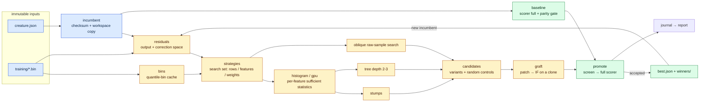
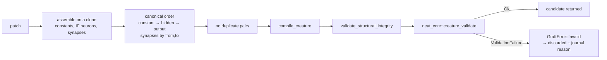

# Architecture

Forests is one Rust crate (`forests/`, package `neat_ai_forests`) organised as
a pipeline. The search side may be approximate; the acceptance side is a single
function that only trusts the full-corpus NEAT-AI-scorer.

## Modules

| Module | Responsibility | Trusts |
|---|---|---|
| `incumbent` | load, validate (compile + round-trip + trailing outputs), SHA-256, byte-exact workspace copy | NEAT-AI-core |
| `corpus` | corpus identity (FNV mix over widths/file names/sizes/head+tail bytes, Lamarck-compatible) and bounded-memory chunk streaming | — |
| `bins` | quantile-bin cache: feature-block streaming passes, stride sampling, tie collapse, binary file with JSON header | — |
| `residuals` | per-record residual in output space and in pre-squash **correction space** via `neat_core::unsquash`; stats, tails, largest-residual records; sidecar keyed by checksum × corpus | NEAT-AI-core kernels |
| `baseline` | full-corpus scorer call on the incumbent alone; local-MSE parity gate (abort / skip) | **scorer** |
| `strategies` | search-set construction: stride / uniform / stratified / residual-weighted rows, all / random / error-ranked features, raw-value re-read for oblique | — |
| `histogram` | CPU reference: `count / Σr / Σr²` per bin, prefix scans, left-only / right-only / two-leaf gains, deterministic top-K, brute-force oracle | — |
| `gpu` | wgpu/WGSL accumulation with per-invocation private partials (no atomics), CPU fold in slice order | — |
| `tree` | level-wise / best-first growth on path-masked histograms, depth ≤ 3 | — |
| `oblique` | 2–3 feature linear conditions on a raw sample; projection sort + coordinate jitter | — |
| `patch` | portable `Leaf` / `Split(Condition{terms, threshold})` tree, `f32` evaluator mirroring the `IF` kernel, provenance, content id | — |
| `graft` | patch → canonical `neat_core::IfNodeSpec` per node, built by `neat_core::graft_if_node` where it covers the shape, merged into a clone in canonical order; NEAT-AI-core compile, structural validation and `creature_validate` | NEAT-AI-core |
| `candidates` | analytical optimum, one-sided variants, magnitude scales, threshold jitter, random stumps; dedup + cap + graft | — |
| `promote` | screen (scorer sample mode) → full-corpus cohort with baseline; strict threshold; same-call baseline drift veto; FP/FN bookkeeping | **scorer** |
| `run` | the loop, outputs, journal, promotion of winners, residual recomputation | — |
| `journal`, `report` | append-only JSONL; economics aggregation | — |
| `xgboost`, `tools` | matrix export, dump → patch conversion with exact `>=` mapping, control run through `promote` | **scorer** |

## Creature validation

Forests changes creature structure, so it gates its own output on
`neat_core::creature_validate` — the shared definition of a valid creature
(Issue #39). The motivating bug was a grafted creature that was returned
without anyone noticing it was structurally invalid; the defect only surfaced
downstream, far from the graft that caused it.

**Where.** `graft::graft_patch` is the single funnel every new creature passes
through (`graft_patches`, `candidates::generate_candidates` and
`candidates::generate_combos` all go through it). The call sits after the
structure is final and before the `Grafted` value is returned, so a violation
is attributed to the graft that caused it.

**Not on load.** An incumbent is *not* validated when it is read. An
externally-supplied creature is not this repo's bug to report, and validating
on ingest would add cost on every read. `incumbent` keeps its existing
compile + round-trip + trailing-output checks.

**Options.** `ValidateOptions { neurons: None, connections: None,
feedback_loop: None, forward_only: creature.forward_only }`. The counts are
left unpinned because the graft *changes* both by construction, so pinning them
would only restate what it just built. `forward_only` follows the creature's
own `forwardOnly` declaration: Forests only ever appends feed-forward structure
(`input → threshold → IF → output`), so for the feed-forward creatures it
actually optimises this is the strongest gate available — it adds the
self-connection, acyclicity and structural-integrity rules on top of the
unconditional ones — while a creature that declares itself recurrent is not
failed for recursion the graft did not introduce.

**Failure policy — reject and journal, never abort.** A validation failure
rejects that candidate; the run continues. It is not an abort, because one bad
graft says nothing about the other candidates in the cohort and killing the run
would lose the whole iteration's scorer work. The rejection is never silent:

- `graft_patch` returns `GraftError::Invalid`, carrying the `ValidationFailure`
  class, `reason`, `message` and the offending `neuron_index` / `synapse_index`.
- `candidates` records that text against the candidate id in its discard list.
- `run` logs it and writes it to `experiments.jsonl` as a `discarded` entry
  (`{ "id", "reason" }`) beside the existing `candidatesDiscarded` count, so
  every rejection is auditable after the run.

**Canonical order is part of being valid.** Two rules the shared validator
enforces are ordering rules, so the graft now emits them rather than appending
blindly: new constants are listed ahead of the first hidden neuron (rule 11 —
`NEURON_ORDER`), and the assembled synapse list is sorted ascending by
`(from index, to index)` (rule 25 — `SORT_FAILURE`). Incumbent neurons and
synapses are preserved unchanged in content and relative order; only their
position in the list can move.

## Determinism

- A run's seed is drawn (or supplied) and written to the `runHeader`; per-iteration seeds derive from it. Sampling, random stumps, bypass selection and oblique combos all use the seeded RNG.
- Histogram accumulation is order-independent in `f64` on the CPU; on the GPU every partial is a sequential loop and the CPU fold is in slice order, so results are reproducible run to run.
- Ranking is always on the CPU with the tie-break `gain desc, feature, bin, kind`.
- Candidate ids are content hashes of `(output, root)`; the same incumbent, caches and seed yield the same ids (tested).

## Memory

- The corpus is never loaded whole: streaming chunks of `--chunk-records` records.
- The bin cache is built in feature blocks sized by `--bin-memory-budget-mib`.
- The residual sidecar is `records × outputs × 2 × f32` (≈18 MB for 2.26 M records × 1 output).
- The in-memory search set is `--search-records × features` bytes of `u8` bins (≈490 MB at 200 k × 2461); `--search-records 0` uses every record (≈5.5 GB at production scale — prefer sampling, or reduce `--feature-fraction`).
