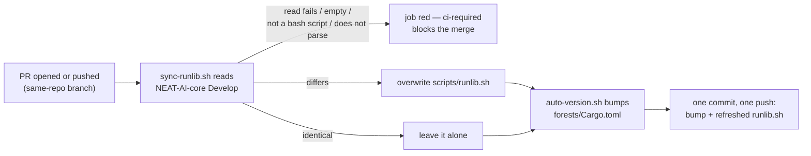

# Adopt the canonical NEAT-AI-core `runlib.sh`, refreshed by the version-increment job

## Summary

`scripts/runlib.sh` is now a byte-identical copy of
`stSoftwareAU/NEAT-AI-core` `Develop` `scripts/runlib.sh` (core#680), and
`scripts/sync-runlib.sh` re-reads that file inside the `version-increment` job
of `ci.yml` so a stale copy on a PR is corrected in the same commit that pushes
the version bump. A read that errors, comes back empty, or comes back as
something that is not a valid bash script exits non-zero and leaves the local
copy untouched — the job reds and `ci-required` blocks the merge rather than
shipping a copy nobody checked. Closes #104.

`forests/Cargo.toml` drops its redundant `[[bin]]` table. Cargo's default bin
(`src/main.rs`, named after the package) is identical, and the canonical script
declines to read any manifest carrying an explicit `[[bin]]`, which cost a
`cargo metadata` call on every fleet run and broke the "runs no cargo command"
half of the contract.

Known limitation, inherited from the existing bump flow and not introduced
here: `version-increment` is skipped on fork PRs (it cannot push to a fork), so
a fork's copy is refreshed when the maintainer's own branch runs the job. The
README says so rather than claiming a guarantee the workflow does not give.

## Evidence

Backend/CLI change — no web interface to screenshot. The evidence is the test
output and the gate.

- `./scripts/test-runlib.sh` — 18 assertions, all passing. A recording `cargo`
  shim that refuses every invocation is what makes "runs no cargo command" an
  assertion rather than an inference.
- `./scripts/test-sync-runlib.sh` — 25 assertions, all passing. A `gh` shim
  ahead of the real one on `PATH` drives the production read, asserting the
  exact `gh api` endpoint and the raw media type the script sends.
- `./quality.sh` — full gate green (shell syntax, shellcheck, both script
  contracts, the neat-core bump gate, codespell, markdownlint, actionlint,
  `cargo deny`, `cargo fmt`, clippy with `-D warnings`, the whole Rust test
  suite, `cargo doc`).
- The copy is byte-identical: `git hash-object scripts/runlib.sh` →
  `3f4f259021b6b257ac53f9443f98c7fbfded8041`, the same blob SHA the GitHub API
  reports for `stSoftwareAU/NEAT-AI-core` `Develop:scripts/runlib.sh`.
- `./scripts/sync-runlib.sh` was run for real against core `Develop` and
  reported `scripts/runlib.sh already matches stSoftwareAU/NEAT-AI-core
  Develop`.
- The new step ran for real on this PR: `Auto-increment Version` passed with
  the refresh ahead of the bump and pushed
  `chore: auto-increment crate version to 0.1.26`, and `CI Required Checks`
  is green.

The refresh, as the `version-increment` job now runs it:

## Acceptance Criteria

<!-- vibe-spec-review inputs="diff+issue-body" -->

- **met** — Byte-identical copy; a stale copy on a PR is refreshed in the bump
  commit — evidence: `scripts/runlib.sh` (blob
  `3f4f259021b6b257ac53f9443f98c7fbfded8041`, `cmp`-identical to core
  `Develop`), `.github/workflows/ci.yml:194-201` (refresh before the bump) and
  `.github/workflows/ci.yml:223-247` (one commit, one push, `scripts/runlib.sh`
  in the diff check and the `git add`) — reviewer: met
- **met** — `./scripts/runlib.sh` installs `~/.cargo/bin/neat_ai_forests` and
  `.neat_ai_forests.version`, removes `target/`; a second run prints
  `[neat_ai_forests] already installed v<x>` and runs no cargo command —
  evidence: `scripts/test-runlib.sh` (`first install: bin, stamp, target/
  removed`, `a second run over that install builds nothing`, both driving the
  real script) and `forests/Cargo.toml:17-20` dropping the `[[bin]]` table that
  otherwise forced a `cargo metadata` call — reviewer: met — reason: the
  reviewer additionally ran the real script against this checkout with a
  sandboxed `CARGO_HOME` and observed the install, the stamp, the `target/`
  removal and the no-cargo second run
- **met** — Tests and quality checks pass — evidence: `./quality.sh` green end
  to end after the final edit; `cargo test --workspace --all-features` green
  against a sibling NEAT-AI-core clone at 0.20.0 — reviewer: met
- **unrequested** — `scripts/sync-runlib.sh` as a standalone script rather than
  inline YAML — reviewer: unrequested — reason: the logic is then shellcheck-ed
  and testable without a workflow run; `ci.yml` calls it in one line
- **unrequested** — `scripts/test-sync-runlib.sh` and `scripts/test-lib.sh`,
  wired into `quality.sh` and the `shell-checks` job — reviewer: unrequested —
  reason: the refresh contract the issue specifies (refresh when stale, fail
  non-zero when the source cannot be read) is only a claim without them
- **unrequested** — `scripts/test-runlib.sh` rewritten — reviewer: unrequested
  — reason: the previous file asserted the #106 script's shape and cannot
  describe the canonical one; its coverage is a strict superset
- **unrequested** — `forests/Cargo.toml` drops its `[[bin]]` table — reviewer:
  unrequested — reason: without it the canonical skip path declines the
  manifest and runs `cargo metadata` on every fleet run, failing the issue's own
  "runs no cargo command" criterion; `cargo metadata` confirms the `bin` target
  is unchanged
- **unrequested** — `neat-core.expected-version` 0.17.0 → 0.20.0 and the
  matching `Cargo.lock` line — reviewer: unrequested — reason: core `Develop`
  moved to 0.20.0 when core#689 (this very file) landed, so the breaking-bump
  gate reds every Forests PR until it is recorded; the rationale and the
  verification are written into the file
- **unrequested** — commit-message composition in
  `.github/workflows/ci.yml:229-241` — reviewer: unrequested — reason: the one
  commit can now carry a refresh without a bump, and a message claiming a
  version increment that did not happen would be false
- **unrequested** — `CHANGELOG.md` entry and the README Mermaid flowchart —
  reviewer: unrequested — reason: house convention for a CI/architecture change

## Standards Review

<!-- vibe-standards-review inputs="diff+CODING-STANDARDS.md" -->

The reviewer read commit `69588d0`; every violation below was fixed in the
follow-up commit on this branch.

- **violation** — README claimed the refresh runs "on every PR", but
  `version-increment` is skipped on fork PRs and `ci-required` counts a skip as
  OK — evidence: `README.md:104` — reason: fixed here; the README now states the
  fork carve-out instead of a guarantee the workflow does not give
- **violation** — the production fetch path was unreachable from the tests: a
  `RUNLIB_SYNC_FETCH_HOOK` env var short-circuited the `gh` call, so the
  endpoint, the media type and the missing-`gh` error were untested — and an
  arbitrary-command env var in a script CI runs with a token is its own smell —
  evidence: `scripts/sync-runlib.sh:36-39` — reason: fixed here; the hook is
  gone and the tests drive the real `gh api` call through a shim on `PATH`
- **violation** — validating only the first line let a truncated body pass, be
  written over the good copy and be pushed — evidence:
  `scripts/sync-runlib.sh:64` — reason: fixed here; the body must also parse
  (`bash -n`), and the shebang test was relaxed to "a bash shebang" so an
  upstream interpreter change does not red every Forests PR
- **violation** — the two test harnesses duplicated the counters, `assert_eq`
  and the summary verbatim (DRY) — evidence: `scripts/test-sync-runlib.sh:13-32`
  — reason: fixed here; both now source `scripts/test-lib.sh`
- **violation** — a comment claimed the refresh "never shows up as a permission
  change" immediately above an unconditional `chmod +x` — evidence:
  `scripts/sync-runlib.sh:74-77` — reason: fixed here; the comment now says what
  the `chmod` is for
- **violation** — the rewritten line used `${GITHUB_BASE_REF}` while the step
  declared `BASE_REF`, departing from the file's declare-then-use convention —
  evidence: `.github/workflows/ci.yml:224` — reason: fixed here; the step
  declares `BASE_REF` and uses it
- **clean** — the copy contract holds (`cmp` against core `Develop` is
  byte-identical); Australian English throughout the added lines
  (behaviour, artefact, honours) with codespell clean; fail-loud in both new
  scripts, each failure path asserted by a real invocation; cross-platform bash
  (`set -euo pipefail`, no bash-4 constructs, shellcheck clean); tests call real
  code with no source-text grepping; workflow hygiene (SHA-pinned actions with
  version comments, least-privilege `permissions`, credential persistence
  disabled on every checkout with the push token supplied per step, `set -euo pipefail` in every new
  multi-line `run:`, no `github.*` interpolated into a `run:` body); no hidden
  or secret paths staged; README and CHANGELOG updated alongside the code.

## Test Plan

- Rewritten `scripts/test-runlib.sh` — the previous version asserted the local
  #106 script's shape and cannot describe the canonical one (documented test
  change: the script under test was replaced by core's). It now asserts, against
  this repository's own manifest and against fixture crates, that an up-to-date
  install runs **no** cargo command at all, that a first install writes
  `~/.cargo/bin/neat_ai_forests` and `.neat_ai_forests.version` and removes
  `target/`, that a second run over it builds nothing, and that a failed build
  keeps `target/` and leaves the installed artefact and its stamp untouched.
- New `scripts/test-sync-runlib.sh` — drives the real `scripts/sync-runlib.sh`
  in throwaway repository sandboxes with a `gh` shim ahead of the real one on
  `PATH`. The shim asserts the endpoint and the raw media type, then answers:
  the canonical file (stale copy refreshed byte-for-byte, stays executable),
  the same file again (left alone), an HTTP failure, an empty body, a JSON
  error body, a truncated body that keeps its shebang, and an alternative
  `#!/bin/bash` shebang. A `PATH` with no `gh` covers the missing-tool path.
  Every failure case asserts a non-zero exit **and** an untouched local copy.
  The missing-`gh` case builds its `PATH` out of the tools the script needs and
  asserts that `PATH` really has no `gh` — an earlier `PATH=/usr/bin:/bin`
  found the runner's own `gh` and went red in CI.
- New `scripts/test-lib.sh` — the counters, `assert_eq` and the summary shared
  by both harnesses.
- Both harnesses are wired into `quality.sh` and the `shell-checks` job of
  `ci.yml`; `scripts/sync-runlib.sh` is added to the `validation` job's
  required-files list.
- Red-capable check for the manifest change: restoring the `[[bin]]` table
  turns `already-installed exits 0` red with the shim reporting
  `UNEXPECTED cargo: metadata --no-deps --format-version 1`; removing it again
  turns it green.
- `cargo test --workspace --all-features` passes against a sibling NEAT-AI-core
  clone at 0.20.0, including the README-as-contract tests over the new README
  section.
