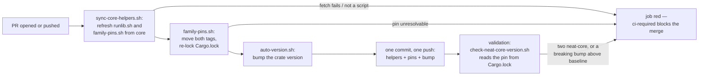

# Pin neat-core and neat-ai-rebase to release tags

## Summary

`forests/Cargo.toml` no longer reaches for sibling checkouts: `neat-core` and
`neat-ai-rebase` are git dependencies on their newest release tags (v0.22.5 and
v0.1.2), and `scripts/family-pins.sh` — a byte-identical copy of NEAT-AI-core
`Develop` (core#681) — moves both pins to the latest release in the
`version-increment` job, in the same commit as the version bump. The two
composite actions that cloned and symlinked the siblings are retired, and
`scripts/check-neat-core-version.sh` now reads the pinned release out of
`Cargo.lock`. Closes #105.

The one-`neat-core` invariant is enforced rather than assumed. The issue (and
this branch's first draft) said cargo refuses two versions of one git package;
the Spec reviewer disproved it — cargo locks both tags happily and the build
only dies afterwards in rustc, as a type mismatch. The gate therefore fails
loud on a `Cargo.lock` carrying more than one `neat-core`, naming both versions.

## Evidence

Backend/CLI change with no web interface, so the evidence is command output.

**The workspace builds with neither sibling present** — the parent directory
holds no `NEAT-AI-core` or `NEAT-AI-Rebase` checkout in this worktree:

```text
$ cargo check --workspace --all-targets --all-features
    Checking neat-core v0.22.5 (https://github.com/stSoftwareAU/NEAT-AI-core?tag=v0.22.5#771ad136)
    Checking neat-ai-rebase v0.1.2 (https://github.com/stSoftwareAU/NEAT-AI-Rebase?tag=v0.1.2#bb67007a)
    Checking neat_ai_forests v0.1.28
    Finished `dev` profile

$ grep 'source = "git' Cargo.lock
source = "git+https://github.com/stSoftwareAU/NEAT-AI-Rebase?tag=v0.1.2#bb67007a…"
source = "git+https://github.com/stSoftwareAU/NEAT-AI-core?tag=v0.22.5#771ad136…"
```

One `neat-core` in the lock: NEAT-AI-Rebase's own pin at v0.1.2 is v0.22.5,
the same release Forests pins.

**A behind pin is moved, and the lock follows** — pins set back to v0.22.4 /
v0.1.1, then the real script run:

```text
$ ./scripts/family-pins.sh
[family-pins] neat-core v0.22.4 → v0.22.5 (forests/Cargo.toml)
[family-pins] neat-ai-rebase v0.1.1 → v0.1.2 (forests/Cargo.toml)
[family-pins] 2 pin(s) moved; Cargo.lock updated
$ git status --short          # back to the committed state, byte for byte
```

**The bump rides the same commit** — `scripts/auto-version.sh` run exactly as
CI runs it, against `origin/Develop`'s manifest: `bumped neat_ai_forests
0.1.27 -> 0.1.28`.

**The copy is byte-identical** to `stSoftwareAU/NEAT-AI-core` `Develop`
`scripts/family-pins.sh` (`cmp`, no output), and `./scripts/sync-core-helpers.sh`
was run for real against core `Develop` — it reported `family-pins.sh already
matches` and refreshed `runlib.sh`, which was behind core#699–#701.

**`./quality.sh` passes end to end**, including cargo-deny, clippy
`-D warnings`, the full 163-test suite and rustdoc.

### CI flow after this change



## Acceptance Criteria

<!-- vibe-spec-review inputs="diff+issue-body" -->

- **met** — The workspace builds with neither sibling checkout present —
  evidence: `forests/Cargo.toml:33,37`, `Cargo.lock:245,257`; the reviewer ran
  `cargo metadata --locked` and the full suite with no sibling on disk —
  reviewer: met
- **met** — A PR with a behind pin gets both tags, `Cargo.lock` and the patch
  bump in one CI commit — evidence: `.github/workflows/ci.yml` runs
  `family-pins.sh` before `auto-version.sh` and stages `forests/Cargo.toml`,
  `Cargo.lock`, `scripts/runlib.sh`, `scripts/family-pins.sh` into one commit;
  reproduced locally from v0.22.4 / v0.1.1 — reviewer: met
- **met** — Tests and quality checks pass — evidence: `./quality.sh` green after
  the final edit; `scripts/test-sync-core-helpers.sh` 32/32,
  `scripts/test-check-neat-core-version.sh` 20/20 — reviewer: met
- **unrequested** — the composite actions were also removed from
  `cargo-quality.yml`, `security.yml` and `sbom.yml`, which the issue did not
  list — reviewer: unrequested — reason: deleting the actions breaks any
  workflow still using them, so these three had to move with `ci.yml` and
  `cargo-upgrade.yml`
- **unrequested** — `deny.toml` gains an `allow-git` allowlist for the two
  family URLs — reviewer: unrequested — reason: `unknown-git = "deny"` fails
  `cargo deny check` on the new git sources; the allowlist names exactly those
  two repositories and every other source must still come from crates.io
- **unrequested** — `neat-core.expected-version` moves 0.20.0 → 0.22.5 with the
  span acknowledged — reviewer: unrequested — reason: pinning the newest release
  trips the repo's own breaking-bump gate, and the documented way to clear it is
  a deliberate acknowledgement; the span was verified by clippy and the full
  test suite
- **unrequested** — new `scripts/test-check-neat-core-version.sh` and its CI /
  `quality.sh` wiring — reviewer: unrequested — reason: the gate's input changed
  from a sibling manifest to `Cargo.lock`, and it had no tests at all; TDD on
  this route requires them
- **unrequested** — `scripts/sync-runlib.sh` renamed to
  `scripts/sync-core-helpers.sh` and generalised to both helpers — reviewer:
  unrequested — reason: the job must now keep two files byte-identical;
  duplicating the 88-line script would have forked the contract, and a script
  named `sync-runlib.sh` that also syncs `family-pins.sh` lies about itself
- **unrequested** — `quality.sh` runs the neat-core gate unconditionally instead
  of skipping when no sibling is present — reviewer: unrequested — reason: the
  gate no longer reads a sibling, so the skip could only hide a real failure
- **unrequested** — `version-increment` gains a Rust toolchain step — reviewer:
  unrequested — reason: `family-pins.sh` shells out to `cargo update`
- **unrequested** — the crate version moves to 0.1.28 and
  `scripts/runlib.sh` is refreshed from core — reviewer: unrequested — reason:
  both are what this repository's own CI would push; committing them here keeps
  the branch self-consistent

Three findings from the Spec reviewer were fixed after its verdict, in commit
`61d67a0`: the "cargo refuses two versions" claim (wrong — corrected in the
README, the manifest comment and the CHANGELOG, and backed by the new
one-`neat-core` gate), the gate reading only the first `neat-core` in the lock,
and the auto-commit message titling a pure pin move as a version bump. Its
fourth — `family-pins.sh` cannot re-lock an already-divergent lock, because a
per-package `cargo update` is then ambiguous — stands: the file is byte-identical
upstream property, so the recovery path is documented in the README instead of
patched here.

## Standards Review

<!-- vibe-standards-review inputs="diff+CODING-STANDARDS.md" -->

- **violation** — `scripts/family-pins.sh` ships with no hermetic contract test,
  unlike every other script here — evidence: `scripts/family-pins.sh:1` —
  reason: stands by design; the file is NEAT-AI-core's and is tested beside the
  original in core's `tests/scripts/family_pins.bats`. A downstream copy of
  those tests would fork a contract this repository must not edit. `CONTRIBUTING.md`
  was corrected so it no longer implies the local gate covers it.
- **violation** — the `version-increment` job now executes bash it just fetched
  from core `Develop`, in a job with `contents: write` — evidence:
  `.github/workflows/ci.yml:206-223` — reason: accepted and now documented in
  the step's comment; it is the same trust boundary every fleet host crosses
  running its copy of `runlib.sh`, the checkout does not persist credentials,
  and the push token is supplied only to the commit step.
- **violation** — the CHANGELOG entry was filed under `### Added` where Keep a
  Changelog wants `### Changed` / `### Removed` — evidence: `CHANGELOG.md:8` —
  reason: fixed here; the entry is split across `### Changed` and `### Removed`.
- **violation** — `scripts/family-pins.sh:9` points at a README heading
  "Canonical family-pins.sh" that did not exist — evidence: `README.md:101` —
  reason: fixed here; the README now carries `Canonical runlib.sh` and
  `Canonical family-pins.sh` sub-headings matching both copies' pointers.
- **violation** — a failed `cargo update` leaves `family-pins.sh` with a
  half-rewritten manifest — evidence: `scripts/family-pins.sh:350-353` —
  reason: stands; it fails loud rather than silently, and the file is upstream
  property. The manual recovery is documented in the README.
- **violation** — `CONTRIBUTING.md` overstated what the local gate covers —
  evidence: `CONTRIBUTING.md:36` — reason: fixed here; it now names the three
  scripts the gate actually tests and says where `family-pins.sh` is tested.
- **clean** — Australian English throughout; fail-loud discipline in both new
  scripts (empty, non-bash, unparsable and failed reads all leave local copies
  untouched and exit non-zero); bash 3.2 compatibility (`set -euo pipefail`, no
  associative arrays, safe empty-array access); tests drive the real scripts and
  assert on exit codes and messages rather than grepping source; the one added
  `uses:` is a 40-char SHA with a version comment; least-privilege
  `permissions:`, `persist-credentials: false`, no `${{ github.* }}` in `run:`
  bodies; `deny.toml` keeps `unknown-git = "deny"` and allowlists exactly two
  repositories; no hidden or secret paths staged.

## Test Plan

- `scripts/test-check-neat-core-version.sh` — **new**, 20 assertions. Drives the
  real gate with purpose-built lockfiles and baselines: exact match, patch
  drift, a pin behind the baseline, a pre-1.0 minor bump and a major bump
  (exit 1), a missing lockfile, a lockfile with no `neat-core`, a `neat-core`
  that is not on a release tag (bare and branch-pinned), a lockfile carrying two
  `neat-core` versions (exit 1, both named), a malformed version, an empty
  baseline, and the repository's own committed lock and baseline.
- `scripts/test-sync-core-helpers.sh` — **rewritten** from
  `test-sync-runlib.sh`, 32 assertions. Both stale copies refreshed
  byte-for-byte, a stale `family-pins.sh` alone refreshed while `runlib.sh` is
  left alone, matching copies untouched, and — served for the *second* helper,
  so a loop that stopped after the first would miss it — a failed read, an empty
  answer, a JSON answer, a truncated answer, an alternative bash shebang, and a
  host with no `gh`.
- `scripts/test-runlib.sh` — unchanged, 18 assertions, passing against the
  refreshed copy.
- `cargo test --workspace --all-features` — 163 tests, all passing against the
  pinned v0.22.5 / v0.1.2 with no sibling checkout present, including the
  real-scorer end-to-end graft and the TypeScript parity fixtures.
- `./quality.sh` — full gate green.
