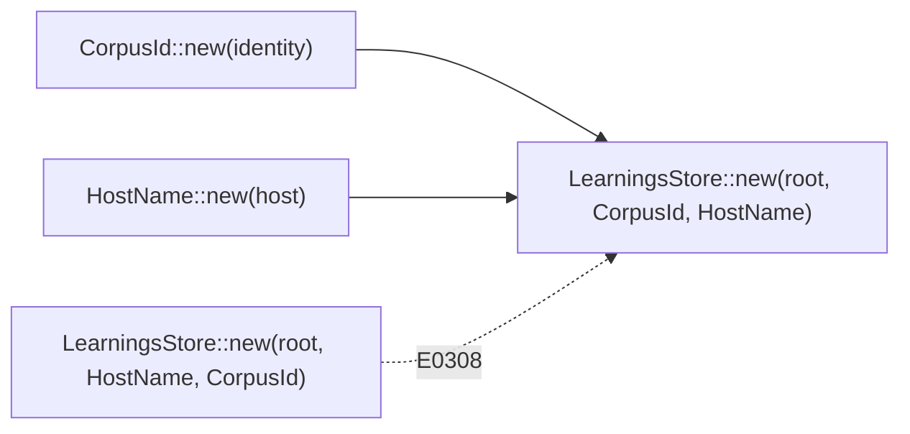

# PR Summary — Issue #116

## Summary

`LearningsStore::new(root, corpus, host)` took `corpus` and `host` as bare
`impl Into<String>`, so a transposed call compiled and quietly filed learnings
under the wrong corpus directory and host file. Two newtypes,
`learnings::CorpusId` and `learnings::HostName`, now fill those slots, which
makes a transposed call a type error (E0308).

- `LearningsStore` stores the newtypes. `host()`, `corpus_dir()` and `file()`
  behave as before.
- Updated callers: `run.rs` (`run_forests` and the fleet-cache test),
  `main.rs` (`prune-learnings`) and the unit tests in `learnings.rs`.
- Added a CHANGELOG entry. README and `docs/` never mention the constructor,
  so they need no change.

Closes #116

## Evidence

This is a backend/API change with no visual surface, so the tests below are
the evidence:

- `learnings::tests::corpus_and_host_are_typed_and_file_under_their_own_slots`
  was written first and failed to compile (`cannot find type CorpusId`)
  before the change. It now passes.
- The doctest on `LearningsStore::new` has two blocks. The plain example
  builds a store. The `compile_fail,E0308` block, which transposes the
  arguments, is rejected by the compiler as intended.

## Test Plan

- [x] `cargo fmt` and `cargo clippy --all-targets -- -D warnings` are clean.
- [x] `cargo test --lib learnings`: 24 passed.
- [x] `cargo test --lib fleet_cache` passes.
- [x] `cargo test --doc learnings`: both doctests pass, including the
      compile-fail one.
- [x] `cargo test --test '*'`: all integration tests pass.
- [x] `./quality.sh`: all quality checks passed.
