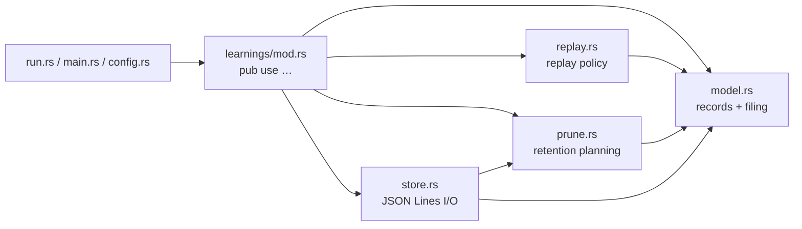

# PR Summary — Issue #117: split `learnings.rs` by concern

## Summary

Closes #117.

`forests/src/learnings.rs` held four separate concerns in about 1,350 lines.
Each now lives in its own module under `forests/src/learnings/`. No code
changed, only where it lives.

| Module | What moved there |
| --- | --- |
| `model.rs` | `Learning`, `Outcome`, `Verdict`, `Context`, `file_verdicts`, `LEARNINGS_FORMAT_VERSION` |
| `replay.rs` | `ReplayConfig`, `choose`, `known_failures`, `grafted_patch_ids`, `DEFAULT_RETRY_AFTER_SECS` |
| `prune.rs` | `PrunePolicy`, `PruneOutcome`, `plan_prune` |
| `store.rs` | `LearningsStore`, `corpora`, `default_host`, `usable_root` |
| `mod.rs` | The module doc, plus `pub use` of every public item |

- **Public API:** `neat_ai_forests::learnings::*` is unchanged, so `run.rs`,
  `main.rs` and `config.rs` compile untouched.
- **Private helpers:** `trimmed` stays private in `model.rs` and `sanitise` in
  `store.rs`.
- **Tests:** each test moved with the code it covers. The shared fixtures
  (`patch`, `learning`, `policy`) live in a `#[cfg(test)]` `test_support.rs`.
- **Docs:** the README layout tree and the CHANGELOG are updated.

## Evidence

- **New test:** `learnings::tests::every_concern_has_its_own_module_and_the_old_paths_still_reach_it`
  goes through a full prune, append, load and replay cycle. It uses the new
  submodule paths and the old `learnings::*` paths together.
  - Against the unsplit file it failed to compile (`cannot find module
    model/prune/replay/store`).
  - It passes after the split.
- **`cargo test --lib learnings`:** 24 passed, 0 failed.
  - That is the 22 existing learnings tests plus the new one, all in their new
    modules.
  - The filter also matches one more test elsewhere in the crate.
- **`cargo clippy --all-targets -- -D warnings`:** clean.
- **`RUSTDOCFLAGS="-D warnings" cargo doc --no-deps`:** clean, so every
  intra-doc link still resolves.
- **`cargo test --test readme_contract`:** 9 passed.
- **`./quality.sh`:** passed.

## Test Plan

- [x] `cargo test --lib learnings` passes, with each moved test in its new module.
- [x] `cargo clippy --all-targets -- -D warnings` is clean.
- [x] Rustdoc runs with warnings denied.
- [x] `cargo test --test readme_contract` passes against the updated layout tree.
- [x] `./quality.sh` passes.
