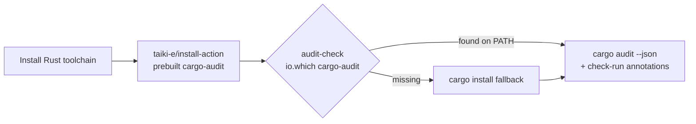

# Install a prebuilt cargo-audit ahead of rustsec/audit-check (#119)

## Summary

Closes #119.

`security.yml`'s `rustsec/audit-check` step compiled `cargo-audit` from source
with `cargo install` on every run, with no cache. A
`taiki-e/install-action` step (`tool: cargo-audit`, the same SHA-pinned v2.81.10
that `cargo-audit.yml` uses) now runs first and puts the prebuilt binary on
`PATH`, so the action skips the compile.

`rustsec/audit-check` stays, and so do its check-run annotations, the reason
the workflow holds `checks: write`.



## Evidence

I checked that the prebuilt binary reaches the action's lookup, as the issue
asked, before relying on it:

- `rustsec/audit-check@858dc40` `src/main.ts` resolves the tool with
  `await cargo.findOrInstall('cargo-audit')`, using `Cargo` from
  `@clechasseur/rs-actions-core`.
- Its `package-lock.json` resolves `@clechasseur/rs-actions-core` to **3.0.5**.
- `rs-actions-core@v3.0.5` `src/commands/cargo.ts`:

  ```ts
  public async findOrInstall(program: string, version?: string): Promise<string> {
    try {
      return await io.which(program, true);
    } catch (error) {
      core.info(`${program} is not installed, installing it now`);
    }
    return await this.installCached(program, version);
  }
  ```

  A `cargo-audit` found on `PATH` is returned as-is, and `installCached` (the
  compile) runs only when the lookup fails.
- `taiki-e/install-action` v2.81.10 resolves to
  `7a79fe8c3a13344501c80d99cae481c1c9085912` via `gh api`, the same pin as
  `cargo-audit.yml`.

## Test Plan

- [x] Added the install step before `rustsec/audit-check` in
      `.github/workflows/security.yml`. It is SHA-pinned with a version comment
      and needs no new permissions.
- [x] Updated the audit-check comment to describe the new install path.
- [x] CHANGELOG `[Unreleased]` entry.
- [x] `./quality.sh` passes locally.
- [ ] CI: the `Security` job log shows no "cargo-audit is not installed,
      installing it now" line, and the audit step finishes in seconds.
