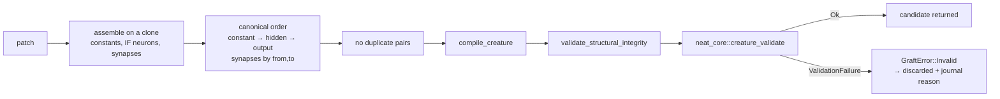

# Validate every new improved creature before returning it (#39)

## Summary

Forests changes creature structure, so it now gates its own output on
`neat_core::creature_validate` — the shared definition of a valid creature.
`graft::graft_patch` is the single funnel every new creature passes through
(`graft_patches`, `candidates::generate_candidates` and
`candidates::generate_combos` all go through it), and the call sits after the
structure is final and before the `Grafted` value is returned, so a violation
is attributed to the graft that caused it instead of surfacing downstream.
Closes #39.

Validating for the first time exposed the motivating defect: **every graft was
producing a structurally invalid creature**. Two of the shared rules are
ordering rules that append-only assembly broke —

- rule 11 (`NEURON_ORDER`) — the shared bias-1 constants were listed *after*
  the incumbent's hidden neurons;
- rule 25 (`SORT_FAILURE`) — grafted synapses were appended, leaving the list
  out of `(from, to)` order.

So the graft now emits NEAT-AI's canonical order: new constants ahead of the
first hidden neuron, new hidden neurons before the first output, and the
assembled synapse list sorted ascending by `(from index, to index)`. Incumbent
neurons and synapses keep their content and relative order — only their
position in the list can move.

**Options, chosen deliberately** (justified in a comment on
`graft::validate_options` and in `docs/architecture.md`):
`ValidateOptions { neurons: None, connections: None, feedback_loop: None,
forward_only: creature.forward_only }`. The counts are unpinned because the
graft *changes* both by construction; `forward_only` follows the creature's own
`forwardOnly` declaration, which is the strongest gate available for the
feed-forward creatures Forests actually optimises (it adds self-connection,
acyclicity and structural-integrity rules) without failing a creature that
declares itself recurrent for recursion the graft did not introduce.

**Failure policy — reject and journal, never abort** (documented in
`docs/architecture.md#creature-validation`). One bad graft says nothing about
the rest of the cohort, and aborting would discard the whole iteration's scorer
work. The rejection is never silent: `GraftError::Invalid` carries the
`ValidationFailure` class, `reason`, `message` and the offending
`neuron_index` / `synapse_index`; `candidates` records that text against the
candidate id; `run` logs it and writes it to `experiments.jsonl` as a new
`discarded` entry (`{ "id", "reason" }`) beside the existing
`candidatesDiscarded` count.

**Not on load.** An incumbent is still not validated when it is read — an
externally supplied creature is not this repo's bug to report, and validating
on ingest costs on every read.

`neat-core.expected-version` is bumped `0.9.9 → 0.9.11`, the version that made
`creature_validate` reachable from the native API (NEAT-AI-core #562).

## Evidence

Backend/CLI change — no web interface to screenshot. Evidence is the test
suite plus the quality gate.



Before this change, `creature_validate` rejected the output of every graft:

```text
identity incumbent → SORT_FAILURE  "1) synapses not sorted 0->5 last to: 7"
mlp incumbent      → NEURON_ORDER  "forest-one-a) type constant after hidden neuron"
IF-output incumbent→ SORT_FAILURE  "3) synapses not sorted"
```

After it, all three pass, singly and stacked
(`every_returned_creature_passes_the_shared_validator`).

Quality gate: `cargo fmt --check`, `clippy -D warnings`,
`cargo test --workspace --all-features`, `cargo doc -D warnings`,
`cargo deny check`, `markdownlint-cli2`, `actionlint` and the neat-core version
gate all pass (74 lib tests + 19 integration tests, 0 failures). The one step
that could not run locally is `codespell`: this container has no `pip`, `pipx`
or system package for it (`pip: command not found`,
`python3 -m ensurepip` → `No module named ensurepip`), so the CI spell-check
job is the gate for it. Prose added here was reviewed by hand.

## Test Plan

New tests (all call real functions and assert on results):

- `graft::tests::every_returned_creature_passes_the_shared_validator` — the
  "valid graft still passes and is unaffected" case: stump and depth-2 patches
  grafted onto identity, MLP and `IF`-output incumbents, singly and stacked via
  `graft_patches`, all satisfy `creature_validate`, with the returned
  `ValidationStats` matching the creature's own neuron/synapse counts.
- `graft::tests::invalid_creature_is_reported_not_swallowed` — grafting onto a
  `hidden, constant, output` incumbent returns `GraftError::Invalid` with
  `reason == "NEURON_ORDER"`, `neuron_index == Some(4)`, and the reason,
  message and index all present in the error text.
- `graft::tests::constant_after_hidden_fixture_clears_every_other_gate` — pins
  that fixture's premise: it compiles, clears
  `validate_structural_integrity` and repeats no synapse pair, so only the
  shared validator can catch it.
- `graft::tests::hidden_neuron_without_an_outward_connection_never_escapes` —
  the acceptance-criteria case; the graft refuses to return it.
- `graft::tests::emitted_synapses_are_in_canonical_order` — the emitted synapse
  list is ascending by `(from, to)` index.
- `candidates::tests::validation_failures_are_recorded_against_the_candidate` —
  an invalid candidate is not scored, and the discard list carries its id plus
  the `NEURON_ORDER` reason and neuron index.
- `journal::tests::discard_reasons_survive_the_journal` — a `discarded` entry
  round-trips through the journal, and a journal written before the field
  existed still reads.

Modified tests (documented, no test removed or disabled):

- `graft::tests::assert_graft_matches_evaluator` — the shared helper asserted
  preservation by *list position* (`synapses[..n] == incumbent.synapses`).
  Canonical ordering makes position meaningless, so it now asserts preservation
  by content and relative order: every incumbent neuron survives unchanged and
  in order, outputs stay trailing, every incumbent synapse is still present
  unchanged, and the graft only *adds* synapses. Every behavioural assertion in
  the helper (record-by-record agreement with the patch evaluator) is unchanged
  and still passes.
- `graft::tests::json_round_trip_preserves_if_roles` — the three `IF` roles are
  now compared as a set, since their listed order follows the canonical synapse
  order rather than the emitter's write order. The intent (all three roles
  survive the JSON round trip) is unchanged.
