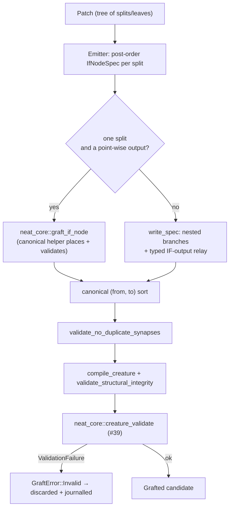

# Adopt neat-core's canonical IF graft helpers in `graft.rs`

## Summary

`forests/src/graft.rs` carried its own interpretation of NEAT-AI's `IF` synapse
roles. NEAT-AI-core has since landed the canonical decision-tree / `IF`
construction helpers (NEAT-AI-core #555) and the duplicate-synapse rule
(NEAT-AI-core #556), so Forests now describes every grafted node as a
`neat_core::IfNodeSpec` and lets `neat_core::graft_if_node` build the shape that
helper covers. Closes #42.

What changed:

- **Canonical condition shape.** The per-split IDENTITY threshold neuron is
  gone. A split's condition is now one synapse per term straight from
  `input-f`, plus one from a shared bias-1 constant carrying `-threshold` —
  NEAT-AI-core's own shape (`neat_core::decision_tree`). Every threshold and
  leaf is therefore a trainable **weight**, and a stump costs one neuron fewer.
- **Delegation.** A lone split entering a point-wise output is built by
  `neat_core::graft_if_node` itself, placement and all.
- **Three shared constants.** One per synapse role (a creature may not carry two
  synapses between the same ordered pair), reused from the incumbent's own
  bias-1 constants where it has them, as #43 established.
- **Duplicate rule.** `check_no_duplicate_synapses` is now a thin wrapper over
  `neat_core::validate_no_duplicate_synapses` rather than a second
  implementation.
- **`creature_validate` at the graft boundary** was already in place from #39
  (`forests/src/graft.rs:assert_valid`, commit `e4b1b23`); this change keeps it
  as the last gate before a candidate escapes.
- **No `neat-core.expected-version` bump was required** — neat-core is 0.9.11
  and the recorded baseline already reads 0.9.11, which the gate reports as
  compatible.

### What is still emitted locally

Two shapes the canonical helper cannot express are still written out by
`graft::write_spec`:

- a **child node feeding its parent's branch** — `graft_if_node` requires every
  outward edge to name an existing neuron and refuses a node with no target, so
  a nested tree cannot be grafted node by node; and
- the **`IF`-output relay**, whose two outward edges must carry the
  `positive` / `negative` roles, where the helper emits untyped ones only.

`write_spec` is pinned to the helper's own output by
`local_emission_matches_the_canonical_helper`, so the fallback cannot drift.
Finishing that adoption needs new capability upstream and is tracked in
stSoftwareAU/NEAT-AI-Forests#48.

### Root cause fixed upstream (cross-repo)

The canonical helpers shipped before `creature_validate` and their output failed
it: every graft left its synapses out of canonical `(from, to)` order (rule 25,
`SORT_FAILURE`), and a spec's constants were inserted beside the node, so a node
reading a hidden source placed a constant after a hidden neuron (rule 11,
`NEURON_ORDER`). A consumer that gates on `creature_validate` — Forests does —
could never have used the result unaided. Both are fixed in NEAT-AI-core on
branch `issue-42-if-graft-emits-validator-clean-creatures` (constants listed
ahead of every hidden neuron, synapse list left in canonical order, canonical
fixtures put through the same sort), with tests asserting every helper output
and every canonical fixture satisfies `creature_validate`.

That fix is **not** required for this PR: Forests supplies its own shared
constants and re-sorts the assembled creature, so the change here is green
against NEAT-AI-core `Develop` as it stands today (verified by running the full
suite against both `Develop` head and the patched branch).

## Evidence

This is a backend/library change with no web interface, so there is no
screenshot to capture. The evidence is the test suite and the structural pins
below.

Graft flow after the change:

Full suite, `cargo test --workspace --all-features -- --test-threads=2`, against
NEAT-AI-core `Develop`: **97 passed, 0 failed** (78 lib + 11 `auto_version` + 5
`readme_contract` + 2 `real_scorer` + 1 `ts_parity`). `cargo fmt --check`,
`cargo clippy --workspace --all-targets --all-features -D warnings`,
`cargo deny check`, `markdownlint-cli2`, `actionlint` and
`RUSTDOCFLAGS="-D warnings" cargo doc` all pass. `codespell` could not be run
locally — it is not installed in this container and there is no `pip`/`sudo` to
install it — so CI is the enforcing gate for spelling.

The behaviour of every grafted creature is unchanged: the same tests that pinned
the old shape against the abstract evaluator record by record still pass, and
`ts_parity` (skipped without `deno` + `rust_scorer` + `NEAT_AI_TS_ROOT`) is
untouched.

## Test Plan

Added in `forests/src/graft.rs`:

- `grafted_split_uses_the_canonical_condition_shape` — a grafted stump adds
  three shared bias-1 constants and one `IF` node and **no** IDENTITY threshold
  neuron; the condition carries the feature at its term weight plus the split
  point as `-threshold` on a shared constant; the three roles take three
  distinct constants.
- `stump_graft_is_built_by_the_canonical_helper` — the creature `graft_patch`
  returns for a stump on a point-wise output is exactly what
  `neat_core::graft_if_node` returns for the equivalent spec, which is what
  proves the delegation is real.
- `local_emission_matches_the_canonical_helper` — `write_spec` emits the same
  neurons and synapses as the canonical helper for a shape both can build, so
  the nested / `IF`-output fallback cannot drift from the canonical reading.
- `stump_reproduces_the_canonical_residual_fixture` — a Forests stump grafted
  onto `neat_core::linear_base_creature()` reproduces
  `neat_core::residual_correction_creature()` on every documented
  `RESIDUAL_CASES` record.

Updated (shape-driven expectations only — no test was removed or weakened):

- `depth1_identity_output_matches_evaluator`, `combined_patches_stack_additively`
  — a second graft now adds 1 neuron, not 2, and a creature ends with three
  shared constants, not two.
- `existing_bias_one_constants_are_reused` — the reused constant takes the
  condition role; two more are created.
- `json_round_trip_preserves_if_roles` — two `condition` edges now, since the
  split point rides on a constant.
- `invalid_creature_is_reported_not_swallowed` — the offending neuron index
  moves from 4 to 5 with the extra shared constant.
- `hidden_neuron_without_an_outward_connection_never_escapes` — also accepts
  `GraftError::Canonical`, the new variant carrying the helper's verbatim
  refusal (it still fails loudly; nothing is swallowed).

Added in NEAT-AI-core (branch
`issue-42-if-graft-emits-validator-clean-creatures`):

- `every_grafted_creature_satisfies_creature_validate`,
  `a_graft_off_a_hidden_source_keeps_its_constants_ahead_of_every_hidden_neuron`,
  `grafted_synapses_are_in_canonical_from_to_order` and
  `every_canonical_fixture_satisfies_creature_validate` — all four failed
  against the unfixed helper and pass after it.
