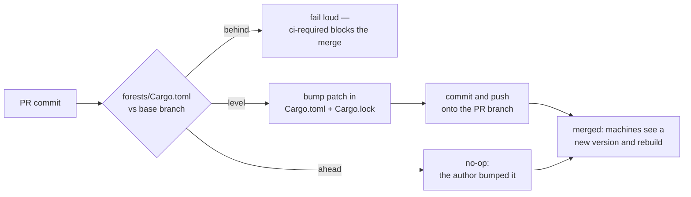

# CI auto-increments the crate version on every PR

## Summary

The unattended machines rebuild the binary only when the crate version changes,
so a PR that lands code at an unchanged `forests/Cargo.toml` version ships
nothing — the machines keep running the stale build. CI now bumps the version
when the author has not. Closes #45.

- **`scripts/auto-version.sh`** — the decision, in one testable place:
  - `head < base` → **fail loud**; a downgrade re-uses a version the machines
    have already built, so the new binary would never install (the merge-conflict
    case that bit NEAT-AI-Discovery).
  - `head > base` → no-op; this PR already bumped it, so no second bump and no
    duplicate commit on re-run.
  - `head == base` → bump the patch, in the manifest **and** in `Cargo.lock`.
  - `--print <manifest>` reports a manifest's version, so the workflow parses
    the version in exactly one place.

  The lockfile is rewritten in place for that one `[[package]]` entry only —
  no `cargo update`, so there is no chance of the bump commit dragging in an
  unquarantined dependency graph, and the step needs no network.

- **`.github/workflows/ci.yml`** — a `version-increment` job (`contents: write`,
  10-minute cap) that fetches the base branch, runs the script, and pushes the
  bump back onto the PR branch. It is a gating job in `ci-required`, so a
  downgrade blocks the merge. Fork PRs are skipped — this workflow cannot push
  to a fork — and a skipped job counts as OK in the aggregator. The push token
  is supplied per step rather than persisted into `.git/config`, so no later
  build script can read it.

### Also in this PR: the build was broken before it

`neat-core` Develop landed `NeuronExport::id` and `CreatureExport::memetic`
(NEAT-AI-core #559) at 09:05 today, 17 minutes after this repo's last green CI
run. Both are `Option` fields with serde defaults, but adding them to a public
struct breaks every literal construction — `forests` did not compile, so **no**
PR could pass CI, including this one. `graft.rs` and `incumbent.rs` now pass
`id: None` / `memetic: None` (grafted neurons carry no runtime id and no memetic
record), and `neat-core.expected-version` records 0.9.9 as the handled baseline.
This is an unblock, not a refactor; adopting the canonical helpers remains #42.

## Evidence

Backend/CLI change — no web interface to screenshot. Evidence is the test suite
plus an end-to-end simulation of the workflow's own git flow.



End-to-end run of the exact commands the `version-increment` job executes,
against a throw-away git repository with a `Develop` base and an unbumped PR
branch:

```text
=== run 1 (PR changed code but not the version) ===
auto-version.sh: bumped neat_ai_forests 0.1.0 -> 0.1.1
chore: auto-increment crate version to 0.1.1
 Cargo.lock         | 2 +-
 forests/Cargo.toml | 2 +-

=== run 2 (re-run on the same PR — must not double-bump) ===
auto-version.sh: already ahead of the base branch (0.1.0 -> 0.1.1) — no bump needed
Version is already ahead of Develop — nothing to commit

=== run 3 (a merge conflict took the base branch's older version back) ===
auto-version.sh: version downgraded: 0.1.0 -> 0.0.9 (forests/Cargo.toml must never
go backwards vs the base branch — the machines rebuild off this version)
exit: 1
```

Quality gate (run against a clean `NEAT-AI-core` Develop sibling, as CI does):

```text
shellcheck: all scripts passed
OK   neat-core 0.9.9 matches handled baseline 0.9.9
markdownlint-cli2: 0 issues in 0 files
actionlint: clean
cargo deny: advisories ok, bans ok, licenses ok, sources ok
cargo fmt --check: clean
cargo clippy --workspace --all-targets --all-features -D warnings: clean
cargo test --workspace --all-features: 86 passed; 0 failed
cargo doc (RUSTDOCFLAGS=-D warnings): clean
```

`codespell` could not be run locally — this container has no `pip`
(`/usr/bin/python3: No module named pip`, `pip: command not found`), so the
`spell-check` CI job is the gate for it.

This PR deliberately leaves `forests/Cargo.toml` at 0.1.0 so the new job
demonstrates itself: its own CI run should push a `chore: auto-increment crate
version to 0.1.1` commit onto this branch.

## Test Plan

New: `forests/tests/auto_version.rs` — 11 tests driving the real script over
throw-away manifests and lockfiles, asserting exit codes, stderr and the
rewritten files (no source-text greps):

- `bumps_the_patch_when_the_pr_has_not_bumped_it` — manifest and lockfile both
  move to 0.1.1.
- `bumps_arbitrary_versions_not_just_the_current_one` — `1.2.9 → 1.2.10`,
  `3.0.0 → 3.0.1`, `0.4.19 → 0.4.20`; the general case, not the fixture's.
- `leaves_the_version_alone_when_the_pr_already_bumped_it` — no rewrite, no
  duplicate bump on a re-run.
- `rejects_a_downgrade_against_the_base_branch` — non-zero exit, manifest
  untouched.
- `rewrites_only_the_named_package_in_the_lockfile` — sibling packages sitting
  at the same version are not touched.
- `fails_loud_when_the_package_is_absent_from_the_lockfile` — a stale lockfile
  is an error, never a silent skip.
- `print_mode_reports_the_package_version`,
  `rejects_a_malformed_base_version`, `rejects_a_missing_manifest`,
  `rejects_wrong_usage` — argument and parse handling.
- `the_repository_manifest_is_ahead_of_or_level_with_the_lockfile` — guards the
  real `forests/Cargo.toml` / `Cargo.lock` pair the CI job rewrites.

Unchanged: the existing 75 tests (unit, README contract, real-scorer, TS parity)
all still pass — no test was removed, skipped or weakened.
