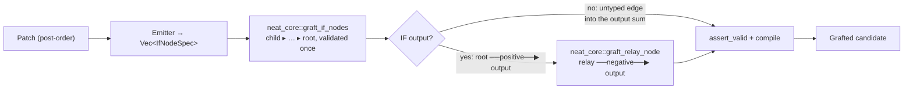

## Summary

Finishes the canonical `IF` graft adoption started in #42: `graft.rs` now
describes nodes and emits nothing itself. Closes #48.

Two shapes could not be expressed with NEAT-AI-core's helper as it stood, so
`graft::write_spec` still wrote them out — a **child node feeding its parent's
branch** (the helper refused a node with no target, so a post-order tree could
not be grafted node by node) and the **`IF`-output relay** (the helper emitted
untyped outward edges only, and an untyped synapse into an `IF` neuron feeds one
branch). Both capabilities now exist upstream, so this PR:

- sends the whole post-order batch to `neat_core::graft_if_nodes` — one
  all-or-nothing graft in which a child carries no outward edge of its own and
  the parent that reads it supplies one;
- gives the root a typed `positive` outward edge into an `IF` output
  (`IfNodeSpec::with_target_role`) and adds the IDENTITY relay for the
  `negative` branch with `neat_core::graft_relay_node`;
- drops the `ones_reach_the_last_constant` fallback — NEAT-AI-core now lists a
  grafted node after **every** constant the creature carries, which is the rule
  that fallback existed to satisfy (`creature_validate` rule 11);
- deletes `write_spec` and the local `typed` / `untyped` synapse writers, and
  moves the canonical-order sort into the test module, where it is an oracle
  rather than a copy of what the graft does.

Emitted structure is unchanged: same neurons, same weights, same role strings —
the two new tests below assert the grafted creature is *exactly* what
NEAT-AI-core's helpers return for the same specs.

### Depends on the NEAT-AI-core change in this run

The upstream capability is pushed to `stSoftwareAU/NEAT-AI-core` on branch
`issue-48-typed-outward-edges-and-batch-graft` (typed outward edges,
`graft_if_nodes`, `RelaySpec` / `graft_relay_node`, and the
"after every constant" placement rule). Forests tracks neat-core through an
unpinned `path` dependency, so **this PR compiles only once that branch is
merged into NEAT-AI-core `Develop`** — CI checks out `Develop` by default. No
commit or pre-release is pinned here to pull it in early. The change is
additive, so the version gate stays at patch drift (sibling 0.10.2 vs baseline
0.10.0); `Cargo.lock` records the sibling head as usual.

## Evidence

Backend/CLI only — no web interface to screenshot. Evidence is the test suite
and the canonical-helper equality tests below.

`./quality.sh` passes locally except `codespell`, which is not installed in this
container (`spell-check: codespell is not installed.`) and which CI runs for
real; every other stage was run individually and is green — shellcheck, the
neat-core version gate (`OK neat-core 0.10.2 matches handled baseline 0.10.0`),
`markdownlint-cli2` (0 issues), `cargo deny check`, `cargo fmt --check`,
`cargo clippy --workspace --all-targets --all-features -D warnings`,
`cargo test --workspace --all-features` (85 + 11 + 5 + 2 + 1 tests, all green)
and `cargo doc` with `RUSTDOCFLAGS="-D warnings"`.

**Mutation evidence** — the new tests were checked against deliberately broken
implementations, and each mutation was reverted afterwards:

| Mutation in `graft_patch` | Tests that went red |
|---------------------------|---------------------|
| root's outward edge emitted untyped for an `IF` output | `if_output_graft_is_built_by_the_canonical_helpers`, `if_output_neuron_receives_the_correction_on_both_branches` |
| post-order batch reversed before `graft_if_nodes` | `nested_graft_is_built_by_the_canonical_batch_helper`, `depth2_and_logistic_output_match_evaluator`, `every_tree_shape_grafts_to_a_valid_duplicate_free_creature`, `every_returned_creature_passes_the_shared_validator`, and 3 more |

## Test Plan

Added in `forests/src/graft.rs`:

- `nested_graft_is_built_by_the_canonical_batch_helper` — a depth-2 patch's
  grafted creature equals `neat_core::graft_if_nodes` applied to the same two
  post-order specs, the child carrying no outward edge of its own.
- `if_output_graft_is_built_by_the_canonical_helpers` — a stump onto an `IF`
  output equals `graft_if_nodes` (typed `positive` root) followed by
  `graft_relay_node` (typed `negative` relay).

Removed `local_emission_matches_the_canonical_helper`: it pinned `write_spec`
against the helper, and `write_spec` no longer exists. The two tests above
replace it with a stronger pin — full creature equality against NEAT-AI-core's
own output for both shapes it used to cover.

Unchanged and still passing, covering the same behaviour end to end:
`depth1_identity_output_matches_evaluator`,
`depth2_and_logistic_output_match_evaluator`,
`if_output_neuron_receives_the_correction_on_both_branches`,
`every_tree_shape_grafts_to_a_valid_duplicate_free_creature`,
`any_number_of_existing_bias_one_constants_yields_three_distinct_sources`
(the 4- and 5-constant cases are the ones the removed fallback used to handle),
`every_returned_creature_passes_the_shared_validator`,
`emitted_synapses_are_in_canonical_order`,
`stump_reproduces_the_canonical_residual_fixture`.

Upstream, `neat-core/tests/if_graft.rs` gains 11 tests for the new capability
(typed outward edges, the batched graft, the relay, and the placement rule),
with their own mutation evidence in
`docs/archive/pr-summaries/pr-summary-forests-48.md` in that repo.
