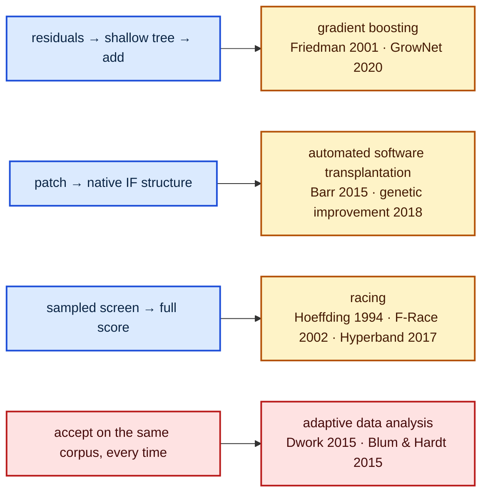

# Name the research behind the residual loop, the graft and the screen (#93)

## Summary

The README described the pipeline entirely in its own terms. Every mechanism in
it already has a name in the literature, so this change names them — without
removing a word of house terminology. Closes #93.

**README.md** gains a `## Where this sits in the literature` section:

| Forests calls it | The literature calls it |
|---|---|
| residuals → shallow tree → add, recompute | gradient boosting (Friedman 2001); with a network as base model, GrowNet (Badirli et al. 2020); trees-and-nets neighbours Kontschieder et al. 2015, Popov et al. 2019 (NODE) |
| the XGBoost external control | the incumbent method for this problem shape (Chen & Guestrin 2016) |
| grafting a patch in as native `IF` structure | automated software transplantation (Barr et al. 2015, ISSTA); genetic improvement (Petke et al. 2018) |
| sampled screen → authoritative promotion | racing (Maron & Moore 1994, Birattari et al. 2002, Jamieson & Talwalkar 2016, Li et al. 2017) |
| the shared learnings cache | memory-based search: tabu search (Glover 1986), adaptive operator selection (Fialho et al. 2010) |
| `--oblique-candidates` / quantile stumps | OC1 (Murthy et al. 1994); random forests (Breiman 2001) as the axis-aligned baseline |

Two of the citations do real work rather than decorating the section:

- **The screen's power.** `docs/benchmarks.md` § *Where the screen sits* now
  cites the racing literature and states what the 5 % screen is powered for: a
  5 % stride sample (≈113 k of 2.27 M records) carries ≈√20 ≈ 4.5× the standard
  error of the authoritative call, while the effects it must resolve are 1e-4
  per accepted iteration tapering to ≈2e-5, per-call family gains of 3.5e-5 down
  to 2.5e-7, and a `--min-improvement` floor of 1e-6. So it vetoes the
  clearly-bad and does not rank — which is what the already-measured evidence
  said (winners spread evenly across ranks 1–8; half the exploratory bypasses
  the screen rejected later cleared the full threshold). `--explore-quota` is
  named as the only measurement of what the screen silently vetoes.
- **The adaptive-overfitting exposure**, stated in `## Safety invariants` next
  to "the scorer is the final authority": acceptance is measured on the same
  corpus every time, across thousands of decisions and the sibling optimisers,
  which is adaptive data analysis (Dwork et al. 2015, Blum & Hardt 2015). The
  holdout question is answered as a fact, not a plan — **no corpus slice is held
  back from any optimiser today** (verified: no holdout exists anywhere in
  `forests/src`; `--search-records` samples for search and
  `--screen-sample-rate` for the screen, but the authoritative call scores the
  whole corpus). The scorer's verdict is therefore an in-corpus guarantee and a
  reported Δ is an upper bound on out-of-sample gain.

`docs/benchmarks.md` § *Shrinkage* also attributes the "analytical optimum
overshoots" result to Friedman's shrinkage parameter, with `--magnitude-scales`
named as that parameter searched rather than fixed.

## Evidence

Documentation change — no web interface to screenshot. The Playwright MCP
browser tools were not present in this session (`ToolSearch` for
`browser_navigate` / `browser_take_screenshot` / `browser_snapshot` returned
"No matching deferred tools found"), so the visual surface was validated by
rendering instead of photographing it.

**Mermaid renders.** All three README blocks — including the new
literature-mapping diagram — were parsed with `mermaid@11` under jsdom:

```text
block 0: OK (flowchart TD)
block 1: OK (flowchart LR)
block 2: OK (flowchart LR)
PARSE_EXIT=0
```

The new diagram maps each stage of the pipeline onto its literature name, and
marks the one stage no method above covers:



**Quality gate.** `./quality.sh` runs clean except for its codespell preflight,
which fails on this container because codespell is not installed and there is no
`pip`/`pipx` to install it (`spell-check: codespell is not installed.`); CI runs
it for real. Spelling was instead checked by hand against the upstream codespell
dictionary — every word added by the diff (654 unique tokens) was matched
against `codespell_lib/data/dictionary.txt` and none is a known misspelling.
Everything else passed: shellcheck, the neat-core version gate,
markdownlint-cli2 (0 issues), `cargo deny check` (advisories/bans/licenses/
sources ok), `cargo fmt --check`, clippy with `-D warnings`,
`cargo test --workspace --all-features` (150 tests, 0 failures) and
`RUSTDOCFLAGS="-D warnings" cargo doc`.

## Test Plan

The deliverable is documentation, so the tests read the documents and assert on
their content — the same contract pattern as the existing
`forests/tests/readme_contract.rs`. All were confirmed failing before the docs
were written.

- `forests/tests/readme_contract.rs`
  - `literature_section_cites_the_research` — extracts the
    `## Where this sits in the literature` section and asserts all 19 citations
    the issue names are inside it (not merely somewhere in the file).
  - `house_terminology_survives_the_literature_section` — "dirty tricks",
    "trust only the scorer" and 🌳 still present.
  - `adaptive_data_analysis_exposure_is_stated_with_the_holdout_answer` — the
    exposure, both citations and the holdout answer are inside
    `## Safety invariants`, i.e. next to "trust only the scorer".
  - `section_body_stops_at_the_next_heading` — covers the new `section()`
    helper, which the repository-layout test now reuses.
- `forests/tests/docs_contract.rs` (new)
  - `screen_description_cites_the_racing_literature` — the racing citations sit
    in § *Where the screen sits*, not elsewhere in the file.
  - `screen_description_states_the_effect_size_it_is_powered_for` — the sample
    size, the effect size and the measured false-negative evidence are stated.
  - `shrinkage_result_is_attributed` — § *Shrinkage* credits Friedman.
  - `subsection_body_stops_at_the_next_top_level_heading` — covers the
    subsection extractor.

`forests/Cargo.toml` is bumped 0.1.17 → 0.1.18 and `Cargo.lock` with it, and the
change is recorded under `[Unreleased]` in `CHANGELOG.md`.
