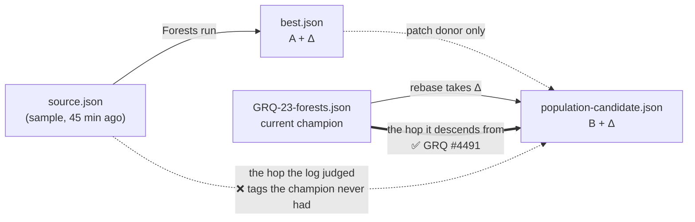

# Own the check-in provenance contract (Issue #95)

## Summary

The pasted failure is **not a Forests defect**, and the honest headline for a
reviewer is that up front. What this PR does is take ownership of the contract
that failure was about, and close the one real gap found while proving it.
Closes #95.

**What the log actually was.** GRQ's check-in guard compared the creature the
run published — an `onto-champion` rebase, i.e. the *current fleet champion*
plus this run's patches — against `source.json`, the sample the run opened on
45 minutes earlier. The five neurons it named are real and the evidence is on
disk in GRQ-sampler:

| uuid | in `GRQ-23-forests.json` (the rebase base) | tags there | tags elsewhere |
|---|---|---|---|
| `79f17191-…cbc5` | yes, `squash: STEP` | none | `intelligentDesign: STEP -> ELU` in `GRQ-21-ockham.json` |
| `86c9e0eb-…d50b` | yes, `squash: BENT_IDENTITY` | none | `intelligentDesign: BENT_IDENTITY -> SELU` |
| `neuron-741325674` | yes, `squash: Mish` | none | `intelligentDesign: Mish -> ELU` |
| `neuron-1236185478` | yes, `squash: HARD_TANH` | none | `intelligentDesign: HARD_TANH -> SELU` |
| `fdc841b2-…5cc` | yes, `squash: Swish` | none | — |

The champion still carries its **original** squash on each of them, so it is a
lineage in which the intelligent-design substitution never happened. Those tags
were never the champion's to lose, and a creature built on the champion cannot
be judged by the sample a different run opened on. GRQ fixed exactly that in
`grq_creature_guard_checkin_lineage` (commit `edb48d3`, GRQ #4508, for GRQ
issue #4491), which walks the publication lineage and judges an
`onto-champion` rebase against the champion instead. That landed ~1.5 h
before this issue was
filed; the log's `Error: Forests candidate lost provenance against the source
champion` string no longer exists in GRQ.

**What was genuinely wrong here.** `meta.rs` has always documented dropping the
source's `memetic` record: it describes fine-tuning of a structure the graft has
since altered, and its bias/weight keys resolve by **runtime neuron id**, which
a graft shifts by inserting its bias-1 constants ahead of the first hidden
neuron. Nothing in Forests enforced it. The record only ever disappeared because
`neat_core::graft_if_nodes` happens to clear it — so the moment neat-core
preserves it, or a write path reaches `serialize_with` without going through
that graft, Forests publishes a `memetic` whose keys silently name *other*
neurons. The existing unit test could never have caught this: its fixture
creature carries no `memetic` at all.

`CreatureMeta::serialize_with` now removes it, and the whole three-rule contract
is asserted end to end rather than on the serialiser in isolation.

## Evidence

Backend/CLI change — no web interface to screenshot. Verified by tests and by
reading the fleet's own artefacts:

- `cargo test --workspace` — **152 passed, 0 failed**.
- The new `memetic` unit test fails against the unfixed code
  (`assert!(v.get("memetic").is_none())` panics with the record still in the
  JSON) and passes after it.
- Root cause read directly, not inferred:
  `GRQ/worker/shared/creature_provenance_guard.sh:234`
  (`grq_creature_guard_checkin_lineage`) and `GRQ/worker/Forests/run.sh:215`,
  plus `jq` over `GRQ-sampler/samples/GRQ-23-forests.json` for the table above.
- `./quality.sh` — all checks pass (shellcheck, neat-core version gate,
  codespell, markdownlint, cargo-deny, fmt, clippy `-D warnings`, tests,
  rustdoc).

## Test Plan

- **Added** `meta::tests::memetic_is_dropped_from_a_creature_that_carries_one`
  — the regression test for the fix. Asserts NEAT-AI-core round-trips `memetic`
  (the precondition that makes the bug possible), then that `serialize_with`
  drops it and the result still parses.
- **Added**
  `run::tests::published_creature_keeps_source_provenance_and_drops_stale_identity`
  — the fleet's #4216 contract on a creature a whole run published: source
  creature-level tag names survive (`score` re-stamped, not kept), the source
  neuron's `discovered` / `intelligentDesign` tags survive verbatim, grafted
  neurons carry their own `forests-patch` tags, and `uuid` / `memetic` are gone.
- **Unchanged** — no existing test was modified or removed.
- **Docs** — README gains "What a published creature keeps"; CHANGELOG records
  the fix and the test.
