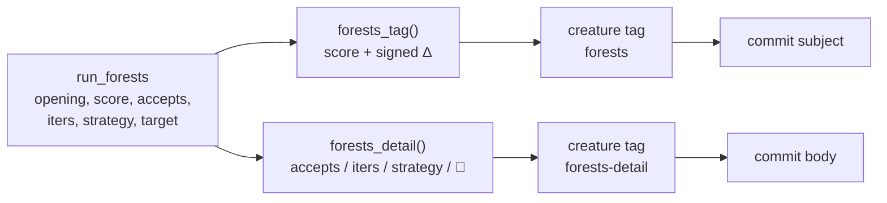

# Shorten the check-in subject to one score and one delta (#98)

## Summary

The `forests` creature tag is what the publishing tool uses as the GRQ-sampler
commit subject, and it carried the entire run:

```text
🌳 Forests · 7 accepts / 7 iters · last: histogram-tree-depth3/scale · 🎯 output-0 · score: 0.407038 improved by 1.27e-4
```

`forests_tag()` in `forests/src/run.rs` now emits one score and one signed
delta in the format the fleet is standardising on, and a new `forests-detail`
tag carries what the subject dropped, for the commit body:

```text
🌳 Forests · score: 0.407038 (+1.27e-4)

7 accepts / 9 iters · last: histogram-tree-depth3/scale · 🎯 output-0
```

The score stays `{:.6}`; the delta is Rust's `{:+.2e}` against the score the run
opened on — no `improved by` prose, no zero-padded exponent (`4.89e-05`). The
delta is always shown, so a run that accepted nothing reads `(+0.00e0)` and a
smaller final score is reported rather than hidden behind a conditional.

Closes #98.

## Evidence

Backend/CLI change with no web interface to screenshot. The evidence is the
tests below, run through the repository gate.



`cargo test --workspace --all-features` — 135 lib tests + integration suites,
all passing. `cargo fmt --check`, `cargo clippy -D warnings`, `cargo deny
check`, `markdownlint-cli2`, `actionlint` and `cargo doc -D warnings` all pass.

One gate step could not run in this container: `codespell` is not installed and
there is no `pip`, `pipx` or root to install it, so `./quality.sh` stops at its
spell-check preflight. Every later step was run individually and passed; CI runs
codespell for real.

The shared-style follow-up issues for the other tools (🪢 Rebase, 🪒 Ockham,
🦒 Lamarck, 🦠 GRQ, 📊 Sampler stats) were **not** filed by this run: the run's
`gh` guard refuses issue creation outside the claim repo —
`[SECURITY] [WRITE_REPO_BLOCKED] Refused issue-create to
stSoftwareAU/NEAT-AI-Rebase … not on run allowlist`. Those repos have no open
issue on the shared commit-message style, so they still need one filed by a
human or by a run claimed against them.

## Test Plan

Added to `forests/src/run.rs`:

- `run::tests::commit_subject_is_one_score_and_one_signed_scientific_delta` —
  pins the exact subject for the improved run from the issue
  (`🌳 Forests · score: 0.407038 (+1.27e-4)`), a zero-delta run and a negative
  delta, and asserts none of `accepts`, `iters`, `last:`, `🎯` or `improved by`
  leaks back into the subject.
- `run::tests::commit_body_detail_carries_accepts_iterations_strategy_and_target`
  — the body detail, including the empty-strategy/empty-target case rendering
  `none` instead of dangling separators.
- `run::tests::published_creature_carries_subject_and_detail_tags` — runs the
  whole loop and asserts `best.json` carries both tags, that the subject
  matches the run's opening and final scores, and that the detail counts the
  acceptances and names the real strategy and target.

Modified (business-logic change, documented):

- `run::tests::loop_accepts_sequentially_and_keeps_source_untouched` asserted
  the old subject contained `improved by`. It now asserts the new subject shape
  and the presence of `forests-detail`. No test was removed or disabled.
